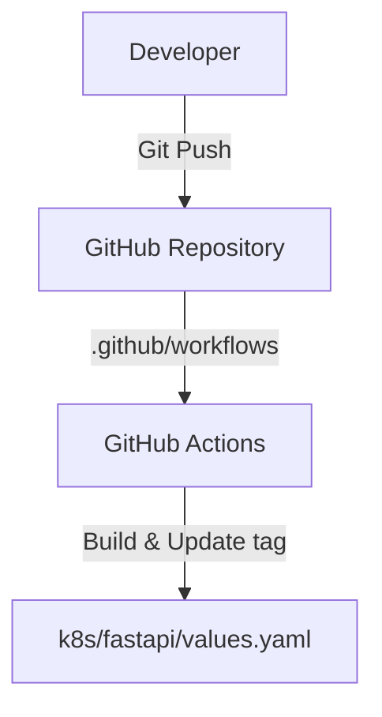

# .github Folder Reference

## Purpose
This folder owns the repository-level GitHub Actions workflows and automation configuration files. It hooks repository events (like a push to `main` branch) to build steps.

## File-by-file explanation

### [workflows/](file:///home/selva/Documents/k8s/karpenter_simple_example/.github/workflows) (Directory)
Contains GitHub Action workflow yaml files.

- > **[app-ci.yaml](file:///home/selva/Documents/k8s/karpenter_simple_example/.github/workflows/app-ci.yaml)**
  > The CI/CD pipeline definition file. Automates building, tagging, pushing FastAPI Docker images, and updating configuration values.
  - *What breaks if missing*: Automated deployments are completely disabled, and any code changes will require manual builds and manual tag updates.

## Architecture
The `.github` folder links developer pushes on the main codebase to automated workflows, which build the container and write changes back to `k8s/fastapi/values.yaml` to trigger GitOps syncs.

## Versions & APIs used
- **GitHub Runner**: `ubuntu-latest`

## Prerequisites
- GitHub Repository settings configured to support Actions.
- IAM user keys defined in GitHub Secrets.

## Commands
Automated by GitHub when pushes land on `main` branch.
- Manual trigger: Go to Actions -> Build and Deploy FastAPI -> Run workflow.

## Troubleshooting
### 1. Actions runner remains queued
- **Cause**: Reached concurrent runner limits, or GitHub service outage.
- **Fix**: Check status page at githubstatus.com or wait for available free runners.

### 2. Actions tab missing from repository
- **Cause**: Actions are disabled in settings.
- **Fix**: Go to Settings -> Actions -> General and check "Allow all actions and reusable workflows".

## Official doc links
- [GitHub Actions Documentation](https://docs.github.com/en/actions)
