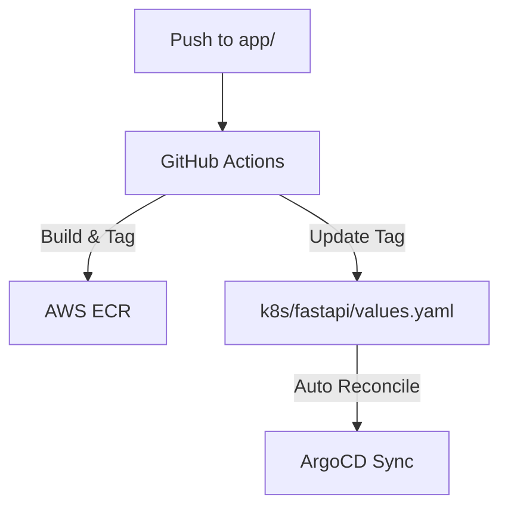

# .github/workflows Folder Reference

## Purpose
This folder owns the CI/CD pipeline automation definitions. It automates testing, container image compilation, publishing to ECR, and writing changes to Helm templates to trigger ArgoCD.

## File-by-file explanation

### [app-ci.yaml](file:///home/selva/Documents/k8s/karpenter_simple_example/.github/workflows/app-ci.yaml)
Defines the pipeline execution steps.

- > `name: Build and Deploy FastAPI`
  > Specifies workflow label in GitHub UI.

- > `on`
  > Declares job triggers.
  - > `workflow_dispatch`
    > Allows platform engineers to manually trigger this job from the Actions panel.
  - > `push`
    > Runs on pushes to `main` branch.
  - > `paths`
    > Filters triggers to only run when files inside `app/**` or `k8s/fastapi/**` are modified. Prevents unnecessary runner usage when terraform files or root files are changed.

- > `env`
  > Declares workflow-wide env variables.
  - > `AWS_REGION: ap-south-1`
    > Directs ECR/STS credentials queries to AWS Mumbai region. Must match `aws_region` in [variables.tf](file:///home/selva/Documents/k8s/karpenter_simple_example/terraform/variables.tf#L18).
  - > `ECR_REPOSITORY: fastapi-app`
    > ECR Repository target. Must match `name` in [ecr.tf](file:///home/selva/Documents/k8s/karpenter_simple_example/terraform/ecr.tf#L31).
  - > `AWS_ACCOUNT_ID: ${{ secrets.AWS_ACCOUNT_ID }}`
    > Pulls AWS Account ID from repository secrets. Used by Docker image build steps.

- > `runs-on: ubuntu-latest`
  > Specifies standard Linux virtual machine runner version.

- > `permissions`
  > Grants execution permissions.
  - > `contents: write`
    > Required to allow workflow to commit image tag updates back to Git repository. If missing, commit/push steps fail.

- > `steps`
  > Linear list of build steps.
  - > `uses: actions/checkout@v4`
    > Clones repository files onto the runner.
  - > `uses: aws-actions/configure-aws-credentials@v4`
    > Sets up environment variable markers for AWS CLI/SDK calls.
    - > `aws-access-key-id: ${{ secrets.AWS_ACCESS_KEY_ID }}`
      > Pulls AWS Access Key ID from GitHub repository secrets.
    - > `aws-secret-access-key: ${{ secrets.AWS_SECRET_ACCESS_KEY }}`
      > Pulls AWS Secret Access Key from GitHub repository secrets.
    - > `aws-region: ${{ env.AWS_REGION }}`
      > Scopes authentication calls to `ap-south-1`.
  - > `id: login-ecr` / `uses: aws-actions/amazon-ecr-login@v2`
    > Authenticates the local docker daemon to ECR. Exposes ECR endpoint registry string in outputs (`steps.login-ecr.outputs.registry`).
  - > `run: echo "tag=${GITHUB_SHA::8}" >> "$GITHUB_OUTPUT"`
    > Generates a unique 8-character image tag from the commit SHA and exports it to subsequent steps.
  - > `docker build` / `docker push`
    > Builds the application container using [Dockerfile](file:///home/selva/Documents/k8s/karpenter_simple_example/app/Dockerfile) and pushes it to ECR.
  - > `sed -i`
    > Replaces the image repository and tag fields inside [values.yaml](file:///home/selva/Documents/k8s/karpenter_simple_example/k8s/fastapi/values.yaml).
  - > `git commit -m "... [skip ci]"`
    > Commits updated values file. `[skip ci]` is critical; omitting it causes GitHub Actions to trigger another run on the bot's commit, causing an infinite build loop.

---

## Architecture
The workflow acts as the connection point between code updates and GitOps configurations.

## Versions & APIs used
- **actions/checkout**: `v4`
- **aws-actions/configure-aws-credentials**: `v4`
- **aws-actions/amazon-ecr-login**: `v2`

## Prerequisites
- AWS IAM User credentials created with ECR write permission.
- Secrets configured in GitHub Repository Settings -> Secrets -> Actions:
  - `AWS_ACCESS_KEY_ID`
  - `AWS_SECRET_ACCESS_KEY`
  - `AWS_ACCOUNT_ID`

## Commands
Automated on commit push. To trigger manually:
1. Go to repository page on GitHub.
2. Select **Actions** -> **Build and Deploy FastAPI**.
3. Select **Run workflow** -> choose branch -> click **Run workflow**.

## Troubleshooting
### 1. ECR Login fails with access denied
- **Cause**: The IAM User mapped to `AWS_ACCESS_KEY_ID` lacks ECR authorization.
- **Fix**: Check IAM user policies and attach `AmazonEC2ContainerRegistryPowerUser` to the user.

### 2. Push fails with `protected branch` error
- **Cause**: Branch rules prevent pushing commits directly to `main` branch.
- **Fix**: Adjust branch protection rules to allow pushes from GitHub bot or admin bypass.

### 3. Infinite build loops
- **Cause**: Git commit message missing `[skip ci]`.
- **Fix**: Ensure the commit step runs `git commit -m "ci: update ... [skip ci]"`.

## Official doc links
- [GitHub Actions Workflows Reference Guide](https://docs.github.com/en/actions/using-workflows/about-workflows)
