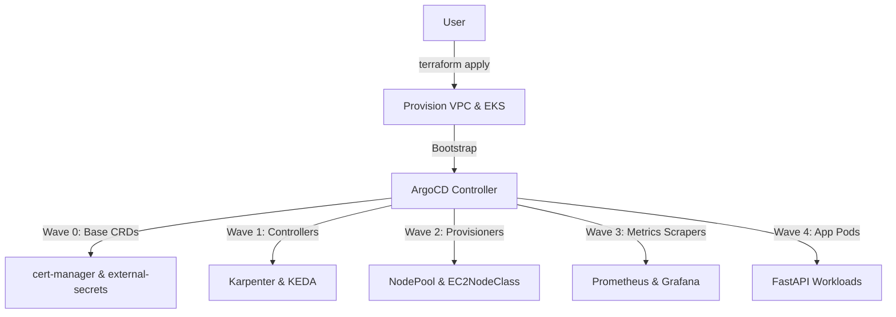

# Karpenter Simple Example (EKS + GitOps + Karpenter)

## Purpose
This repository provides a reference implementation for deploying a FastAPI application on Amazon EKS with dynamic, zone-aware autoscaling powered by Karpenter and KEDA. The infrastructure is bootstrapped using Terraform, while the entire application and middleware lifecycle is managed via GitOps with ArgoCD.

## File-by-file explanation
- **[app/](file:///home/selva/Documents/k8s/karpenter_simple_example/app)** (Directory):
  - *What it does*: Contains the FastAPI application code, Dockerfile, and requirements.
  - *What breaks if missing*: The web application cannot be compiled or run.
- **[terraform/](file:///home/selva/Documents/k8s/karpenter_simple_example/terraform)** (Directory):
  - *What it does*: Bootstrap Terraform HCL code to build VPC, EKS cluster, IAM roles, and install ArgoCD.
  - *What breaks if missing*: AWS EKS infrastructure and identity roles will not exist.
- **[k8s/](file:///home/selva/Documents/k8s/karpenter_simple_example/k8s)** (Directory):
  - *What it does*: Holds Helm charts and YAML manifests sync configurations.
  - *What breaks if missing*: ArgoCD will have no resources to deploy to EKS.
- **[.github/](file:///home/selva/Documents/k8s/karpenter_simple_example/.github)** (Directory):
  - *What it does*: Configures CI/CD automation workflow runs.
  - *What breaks if missing*: Automated testing, building, and deployments are disabled.

## Architecture
The platform is designed around GitOps principles. Terraform sets up the core VPC, EKS cluster, system node group, and bootstraps ArgoCD. Once ArgoCD starts up, it takes over the deployment of all other components in ordered waves:



## Versions & APIs used
- **Terraform Engine**: `>= 1.8`
- **Kubernetes (EKS)**: `1.33+`
- **HashiCorp AWS Provider**: `~> 6.0`
- **Karpenter**: `v1.11+` (`karpenter.sh/v1`, `karpenter.k8s.aws/v1`)
- **KEDA**: `2.20+` (`keda.sh/v1alpha1`)
- **Istio**: `1.29+` (Gateway API `HTTPRoute` integration)
- **FastAPI**: `0.136+`

## Prerequisites
- AWS CLI configured with administrator access.
- Terraform `>= 1.8` installed locally.
- `kubectl` client utility installed locally.
- `envsubst` command-line utility.

## Commands
### 1. Provision infrastructure
```bash
cd terraform
terraform init
terraform apply -var='git_repository_url=https://github.com/selvakumarperumal/karpenter_simple_example.git'
```

### 2. Configure kubectl CLI
```bash
$(terraform -chdir=terraform output -raw configure_kubectl)
```

### 3. Apply the root ArgoCD App of Apps manifest
```bash
export GIT_REPOSITORY_URL="https://github.com/selvakumarperumal/karpenter_simple_example.git"
export CLUSTER_NAME="karpenter-demo"
export AWS_REGION="ap-south-1"

envsubst < k8s/argocd/app-of-apps.yaml | kubectl apply -f -
```

### 4. Inject secrets manager credentials
```bash
aws secretsmanager put-secret-value \
  --secret-id karpenter-demo/GOOGLE_API_KEY \
  --secret-string "my-super-secret-key"
```

## Troubleshooting
### 1. `terraform apply` fails during cluster creation
- **Cause**: Reached AWS account resource limits (EIPs, VPCs, or IAM limits).
- **Fix**: Check AWS console limit notifications and request limit increases.

### 2. ArgoCD cannot sync application repository
- **Cause**: Private repository permissions issues or malformed URL.
- **Fix**: Check repository URL parameters inside the applied manifests and verify access rights.

### 3. Application pods remain in Pending status
- **Cause**: Karpenter NodePool configuration constraints do not match the pod requests.
- **Fix**: Check Karpenter controller logs: `kubectl logs -n kube-system -l app.kubernetes.io/name=karpenter`.

## Official doc links
- [Kubernetes EKS Documentation](https://docs.aws.amazon.com/eks/)
- [ArgoCD Documentation](https://argo-cd.readthedocs.io/)
- [Karpenter Scaling Documentation](https://karpenter.sh/)
