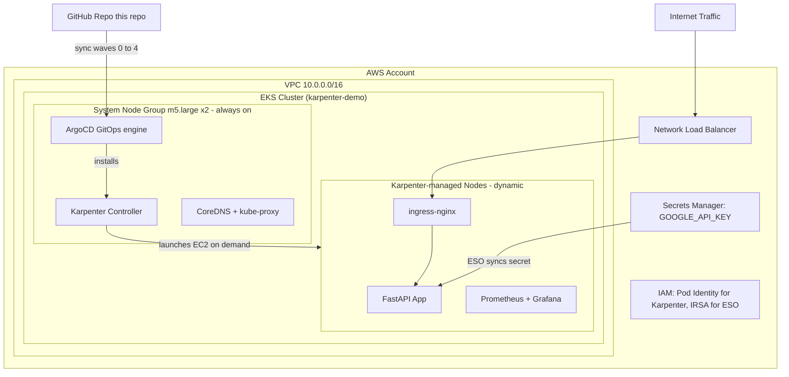
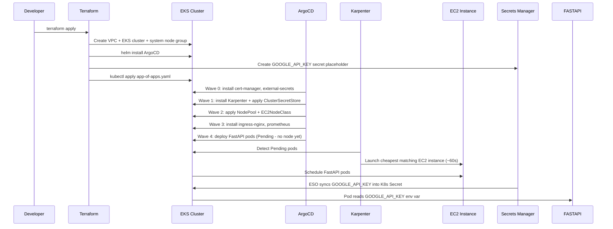

# Karpenter Demo — EKS + GitOps + Karpenter

A production-grade reference implementation of EKS with Karpenter autoscaling, fully managed via GitOps (ArgoCD). Terraform provisions the foundation; ArgoCD owns every subsequent change.

---

## Architecture Overview



---

## How It Works End-to-End



---

## Repository Structure

```
.
├── README.md                    <- You are here
├── app/                         <- FastAPI application source code
│   ├── Dockerfile               <- Container image definition
│   ├── main.py                  <- FastAPI app with /  /health endpoints
│   └── requirements.txt         <- fastapi + uvicorn
├── terraform/                   <- AWS infrastructure (run once)
│   ├── providers.tf             <- Terraform + AWS + Kubernetes + Helm providers
│   ├── main.tf                  <- Locals and data sources
│   ├── variables.tf             <- Input variables
│   ├── vpc.tf                   <- VPC, subnets, NAT Gateway
│   ├── eks.tf                   <- EKS cluster + system node group + add-ons
│   ├── iam-karpenter.tf         <- Karpenter IAM (Pod Identity + node role)
│   ├── iam-external-secrets.tf  <- ESO IAM role (IRSA) + K8s SA bootstrap
│   ├── secrets.tf               <- Secrets Manager secret definitions
│   ├── helm-argocd.tf           <- ArgoCD Helm install + app-of-apps bootstrap
│   ├── helm-karpenter.tf        <- Architecture note (Karpenter is ArgoCD-managed)
│   └── outputs.tf               <- cluster_name, endpoint, kubectl command
└── k8s/                         <- Kubernetes manifests (GitOps, owned by ArgoCD)
    ├── argocd/
    │   ├── app-of-apps.yaml     <- Root Application: watches k8s/argocd/apps/
    │   └── apps/                <- One Application YAML per tool/service
    │       ├── cert-manager.yaml
    │       ├── external-secrets.yaml
    │       ├── karpenter.yaml
    │       ├── karpenter-config.yaml
    │       ├── app-secrets.yaml
    │       ├── ingress-nginx.yaml
    │       ├── prometheus.yaml
    │       └── fastapi.yaml
    ├── karpenter-config/        <- NodePool + EC2NodeClass (Kustomize)
    ├── secrets/                 <- ClusterSecretStore + ExternalSecrets
    └── fastapi/                 <- Deployment, Service, Ingress, Namespace
```

---

## Prerequisites

| Tool | Version | Purpose |
|---|---|---|
| Terraform | >= 1.8 | Provision AWS infrastructure |
| AWS CLI | >= 2.x | Authenticate to AWS |
| kubectl | >= 1.29 | Interact with the cluster |

---

## Quick Start

### 1. Configure AWS credentials
```bash
aws configure
# or: export AWS_PROFILE=your-profile
```

### 2. Apply Terraform (replace the Git URL)
```bash
cd terraform
terraform init
terraform apply -var='git_repository_url=https://github.com/YOUR_ORG/karpenter-demo.git'
```

This creates: VPC, EKS, IAM roles, Secrets Manager placeholder, ArgoCD + App of Apps.
All sync waves then fire automatically.

### 3. Set the secret value
```bash
aws secretsmanager put-secret-value   --secret-id karpenter-demo/GOOGLE_API_KEY   --secret-string your-actual-key
```

### 4. Access ArgoCD
```bash
kubectl port-forward svc/argocd-server -n argocd 8080:443
# https://localhost:8080
# Password:
kubectl get secret argocd-initial-admin-secret -n argocd   -o jsonpath='{.data.password}' | base64 -d
```

### 5. Watch Karpenter provision nodes
```bash
kubectl get pods -n fastapi -w       # FastAPI pods: Pending -> Running
kubectl get nodes -w                  # New node appears in ~60s
```

---

## Sync Wave Order

| Wave | App | Installs | Reason for ordering |
|---|---|---|---|
| 0 | cert-manager | TLS manager + CRDs | CRDs must exist before any Certificate resource |
| 0 | external-secrets | ESO controller + CRDs | CRDs must exist before any ExternalSecret resource |
| 1 | karpenter | Karpenter controller | CRDs must exist before NodePool/EC2NodeClass |
| 1 | app-secrets | ClusterSecretStore + ExternalSecret | ESO must be running to process them |
| 2 | karpenter-config | NodePool + EC2NodeClass | Karpenter CRDs must exist |
| 3 | ingress-nginx | NGINX + NLB | Needs Karpenter nodes to schedule on |
| 3 | prometheus | Prometheus + Grafana | Needs Karpenter nodes to schedule on |
| 4 | fastapi | FastAPI application | All infrastructure must be ready |

---

## Key Design Decisions

| Decision | Reason |
|---|---|
| Two node layers (system + Karpenter) | System nodes keep ArgoCD/Karpenter alive even when app nodes scale to zero |
| ArgoCD installs Karpenter (not Terraform) | Avoids chicken-and-egg: Karpenter needs nodes to run but creates nodes |
| Hardcode karpenter-node-role | Static name we control; removes SSM + ExternalSecret just for one IAM role name |
| IRSA for ESO, Pod Identity for Karpenter | ESO SA pre-created by Terraform needs annotation; Karpenter SA is chart-managed |
| Secrets Manager for app secrets | Industry-standard secure storage; ESO creates K8s Secret automatically |

---

## Useful Commands

```bash
# Configure kubectl
$(terraform -chdir=terraform output -raw configure_kubectl)

# Watch all pods
kubectl get pods -A

# Karpenter decisions
kubectl logs -n kube-system -l app.kubernetes.io/name=karpenter -c controller --tail=50

# Check ESO secret sync
kubectl get externalsecret -n fastapi

# Grafana
kubectl port-forward svc/prometheus-grafana -n monitoring 3000:80
# http://localhost:3000  admin / changeme

# Destroy
terraform -chdir=terraform destroy
```
