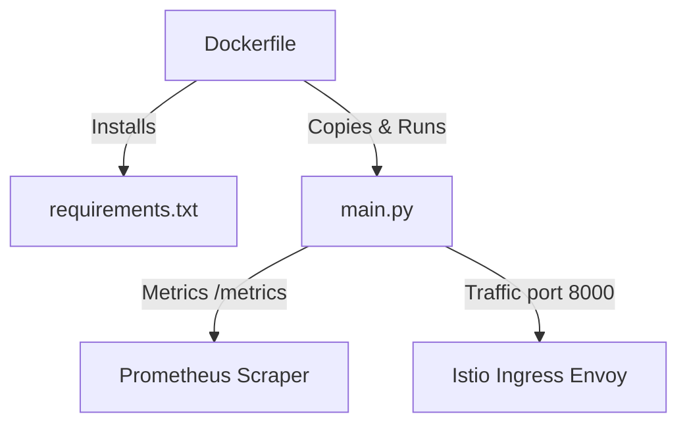

# app Folder Reference

## Purpose
This folder owns the core FastAPI application source code, Docker packaging instructions, and Python dependencies. It exposes the HTTP endpoints and handles auto-instrumentation for Prometheus metrics used by KEDA for scaling.

## File-by-file explanation

### [main.py](file:///home/selva/Documents/k8s/karpenter_simple_example/app/main.py)
Implements the HTTP server endpoints and exports application metrics.

- > `app = FastAPI(title="Hello World API", version="1.0.0")`
  > Initializes the FastAPI application context. Specifying a descriptive title and version sets up metadata for the OpenAPI docs page. Omitting it defaults metadata fields.

- > `Instrumentator().instrument(app).expose(app)`
  > Instruments all HTTP routes and exposes metrics on `GET /metrics`. This publishes the `http_requests_total` metric scraped by Prometheus, which KEDA queries. If missing, metrics-based auto-scaling will fail.

- > `class RootResponse(BaseModel)`
  > Declares the Pydantic schema for the root endpoint response. Enforces data validation and automatic swagger documentation.
  - > `message: str`
    > Greeting string returned to clients.
  - > `version: str`
    > Represents application version metadata (currently `"1.0.0"`).
  - > `node: str`
    > Worker node name (reads `NODE_NAME` env var, populated from Downward API in [deployment.yaml](file:///home/selva/Documents/k8s/karpenter_simple_example/k8s/fastapi/templates/deployment.yaml#L86-L89)).
  - > `pod: str`
    > Pod name (reads `POD_NAME` env var, populated from Downward API in [deployment.yaml](file:///home/selva/Documents/k8s/karpenter_simple_example/k8s/fastapi/templates/deployment.yaml#L81-L84)).
  - > `zone: str`
    > AWS Availability Zone (reads `ZONE` env var, populated from Helm value template in [deployment.yaml](file:///home/selva/Documents/k8s/karpenter_simple_example/k8s/fastapi/templates/deployment.yaml#L90-L92)).

- > `class HealthResponse(BaseModel)`
  > Declares Pydantic schema for the health endpoint.
  - > `status: str`
    > Status indicator, returning `"healthy"`.

- > `@app.get("/", response_model=RootResponse)`
  > Maps GET requests on root `/` to return a `RootResponse`. Matches target route in [httproute.yaml](file:///home/selva/Documents/k8s/karpenter_simple_example/k8s/fastapi/templates/httproute.yaml#L36).

- > `@app.get("/health", response_model=HealthResponse)`
  > Maps GET requests on `/health` to return a `HealthResponse`. Used by readiness and liveness probes in [deployment.yaml](file:///home/selva/Documents/k8s/karpenter_simple_example/k8s/fastapi/templates/deployment.yaml#L103-L121). If changed or broken, the pod probes will fail, leading to routing exclusion or restart loops.

---

### [Dockerfile](file:///home/selva/Documents/k8s/karpenter_simple_example/app/Dockerfile)
Handles container image packaging.

- > `FROM python:3.12-slim`
  > Specifies the base container image. Slim variant is used to reduce image size and minimize security vulnerability surface area.

- > `WORKDIR /app`
  > Sets the default working directory for subsequent instructions.

- > `COPY requirements.txt .`
  > Copies Python package specifications. Copied separately before the source code to cache the package install layer during builds.

- > `RUN pip install --no-cache-dir -r requirements.txt`
  > Installs packages without keeping cache files, minimizing final image layer sizes.

- > `COPY main.py .`
  > Copies the main application script into the image.

- > `RUN adduser --disabled-password --gecos "" appuser`
  > Creates a standard system user `appuser` with no password or contact metadata.

- > `USER appuser`
  > Switches container execution context to non-root `appuser`. Running as root violates Kubernetes security policies and triggers container security scan alerts.

- > `EXPOSE 8000`
  > Declares that the container is designed to listen on port 8000. Documentative only; must match the containerPort in [deployment.yaml](file:///home/selva/Documents/k8s/karpenter_simple_example/k8s/fastapi/templates/deployment.yaml#L77).

- > `CMD ["uvicorn", "main:app", "--host", "0.0.0.0", "--port", "8000"]`
  > Specifies default startup command to launch the ASGI server. Binding to `0.0.0.0` is required to accept connections from outside the container.

---

### [requirements.txt](file:///home/selva/Documents/k8s/karpenter_simple_example/app/requirements.txt)
Specifies libraries required for execution.

- > `fastapi==0.136.3`
  > Enforces FastAPI version mapping. Pins framework to latest stable to ensure OpenAPI compliance and stability.
- > `uvicorn[standard]==0.49.0`
  > ASGI server package used to drive the FastAPI context.
- > `prometheus-fastapi-instrumentator==7.1.0`
  > Library to auto-measure endpoints latency, throughput, and error rates.

---

## Architecture
The application runs as a simple microservice. `main.py` imports dependencies from `requirements.txt` and is packaged into an image using the `Dockerfile`.



## Versions & APIs used
- **Python**: `3.12-slim`
- **FastAPI Framework**: `0.136.3`
- **Uvicorn ASGI**: `0.49.0`

## Prerequisites
- Local python `3.12` runtime environment to test or run manually.
- Docker runtime to build images locally.

## Commands
### 1. Build and run app container locally
```bash
docker build -t fastapi-app:latest ./app
docker run -p 8000:8000 fastapi-app:latest
```

### 2. Verify FastAPI app health locally
```bash
curl http://localhost:8000/health
```

## Troubleshooting
### 1. Pods fail readiness probe with status `404` or connection refuse
- **Cause**: Port mismatch or wrong probe path.
- **Fix**: Verify uvicorn is running on port `8000` and `GET /health` is exposed in `main.py`.

### 2. Image build fails with pip error
- **Cause**: Packages or versions listed inside `requirements.txt` are unavailable.
- **Fix**: Check spelling of package pins and verify internet accessibility from the build runner.

### 3. Container exits with permissions errors
- **Cause**: App tries to write to root directories or write logs to restricted paths.
- **Fix**: Ensure `appuser` has write permissions to local application directories, or switch write directories to `/tmp`.

## Official doc links
- [FastAPI Reference Docs](https://fastapi.tiangolo.com/)
