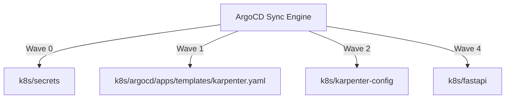

# k8s Folder Reference

## Purpose
This folder owns the Kubernetes configuration files, customized templates, and Helm charts. These files represent the target deployment state synced to the EKS cluster via ArgoCD.

## File-by-file explanation

### [argocd/](file:///home/selva/Documents/k8s/karpenter_simple_example/k8s/argocd) (Directory)
Owns the ArgoCD App of Apps bootstrap configurations.
- *What it does*: Bootstraps child application configurations.
- *What breaks if missing*: ArgoCD cannot identify or manage cluster components.

### [fastapi/](file:///home/selva/Documents/k8s/karpenter_simple_example/k8s/fastapi) (Directory)
Owns the FastAPI application deployment Helm chart.
- *What it does*: Configures deployments, service rules, gateways, and autoscalers.
- *What breaks if missing*: FastAPI application will not run or expose endpoints.

### [karpenter-config/](file:///home/selva/Documents/k8s/karpenter_simple_example/k8s/karpenter-config) (Directory)
Owns the Karpenter capacity provisioning configurations.
- *What it does*: Customizes NodePool and EC2NodeClass targets.
- *What breaks if missing*: Karpenter will not spin up nodes for pending application pods.

### [secrets/](file:///home/selva/Documents/k8s/karpenter_simple_example/k8s/secrets) (Directory)
Owns External Secrets Operator sync configurations.
- *What it does*: Retrieves database credentials/API keys from Secrets Manager.
- *What breaks if missing*: App containers crash due to missing secrets/env vars.

## Architecture
The deployment architecture uses GitOps. ArgoCD reads this directory structure and applies configuration components in wave sequence:



## Versions & APIs used
- **EKS target**: `1.33+`
- **Helm**: `3.17+`

## Prerequisites
- EKS cluster running (configured via Terraform).
- ArgoCD bootstrapped in EKS cluster namespace.

## Commands
### 1. Dry-run and render templates locally
```bash
helm template k8s/fastapi
helm template k8s/karpenter-config
helm template k8s/secrets
```

## Troubleshooting
### 1. Namespace is stuck terminating
- **Cause**: Active resource hooks or finalizers prevent deletion.
- **Fix**: Remove the finalizers manually using `kubectl patch`.

### 2. Chart templating fails
- **Cause**: Missing default values in subfolder charts.
- **Fix**: Verify keys inside `values.yaml` in each subfolder.

## Official doc links
- [Kubernetes Architecture Concepts Guide](https://kubernetes.io/docs/concepts/architecture/)
