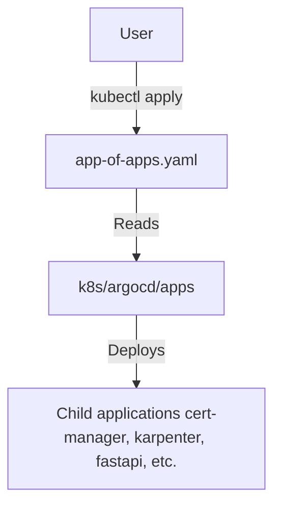

# k8s/argocd Folder Reference

## Purpose
This folder owns the root App-of-Apps bootstrap manifest for ArgoCD. Reconciling this folder registers the root application in ArgoCD, which in turn reads `k8s/argocd/apps/` to install all other charts in ordered sync waves.

## File-by-file explanation

### [app-of-apps.yaml](file:///home/selva/Documents/k8s/karpenter_simple_example/k8s/argocd/app-of-apps.yaml)
Root ArgoCD application configuration.

- > `apiVersion: argoproj.io/v1alpha1`
  > Specifies the custom resource group API for ArgoCD Application definitions.

- > `kind: Application`
  > Declares this resource is an ArgoCD Application to be reconciled.

- > `metadata`
  > Resource metadata tags.
  - > `name: app-of-apps`
    > Specifies root application name identifier in ArgoCD.
  - > `namespace: argocd`
    > Deploys the application context in the namespace where the ArgoCD controller is running.

- > `spec`
  > Defines operational specifications.
  - > `project: default`
    > Maps this application to the default project security boundary.
  - > `source`
    > Points to the repository containing target manifests.
    - > `repoURL: ${GIT_REPOSITORY_URL}`
      > Parameterized Git repository path containing configurations. Populated via `envsubst` during manual bootstrap.
    - > `targetRevision: HEAD`
      > Configures ArgoCD to follow the latest commit on the branch.
    - > `path: k8s/argocd/apps`
      > Target directory path containing the child applications list.
    - > `helm.parameters`
      > Overrides variables in the child applications.
      - > `- name: repoURL, value: ${GIT_REPOSITORY_URL}`
        > Injects Git repository URL so child applications can pull sub-manifests.
      - > `- name: clusterName, value: ${CLUSTER_NAME}`
        > Injects EKS cluster name for AWS tag lookups (matches `cluster_name` in [variables.tf](file:///home/selva/Documents/k8s/karpenter_simple_example/terraform/variables.tf#L24)).
      - > `- name: awsRegion, value: ${AWS_REGION}`
        > Injects target AWS region for endpoint discovery.
  - > `destination`
    > Deployment target configurations.
    - > `server: https://kubernetes.default.svc`
      > Points to the local cluster API Server endpoint.
    - > `namespace: argocd`
      > Targets deployment folder for application contexts.
  - > `syncPolicy`
    > Reconcile policies.
    - > `automated`
      > Configures auto-deploy parameters.
      - > `prune: true`
        > Automatically deletes resources from the cluster when their manifests are removed from Git.
      - > `selfHeal: true`
        > Overwrites manual overrides made in the cluster using kubectl, enforcing Git as the source of truth.

---

## Architecture
The root Application reads files inside `apps/` and provisions child applications.



## Versions & APIs used
- **ArgoCD API**: `argoproj.io/v1alpha1`

## Prerequisites
- EKS Cluster running.
- ArgoCD Controller bootstrapped (installed via Terraform Helm provider in [helm-argocd.tf](file:///home/selva/Documents/k8s/karpenter_simple_example/terraform/helm-argocd.tf#L33)).

## Commands
### 1. Apply root App of Apps configuration
Export environment variables matching your deployment, then run:
```bash
export GIT_REPOSITORY_URL="https://github.com/selvakumarperumal/karpenter_simple_example.git"
export CLUSTER_NAME="karpenter-demo"
export AWS_REGION="ap-south-1"

envsubst < k8s/argocd/app-of-apps.yaml | kubectl apply -f -
```

## Troubleshooting
### 1. Root application remains OutOfSync
- **Cause**: The `repoURL` was not substituted correctly, or Git repository is private.
- **Fix**: Check `repoURL` matches your fork URL. Configure private repo credentials in ArgoCD if private.

### 2. Applications fail to synchronize templates
- **Cause**: The variables `CLUSTER_NAME` or `AWS_REGION` were empty before running `envsubst`.
- **Fix**: Export variables and re-run `envsubst | kubectl apply`.

## Official doc links
- [ArgoCD Application Concept Guide](https://argo-cd.readthedocs.io/en/stable/understanding_concepts/)
