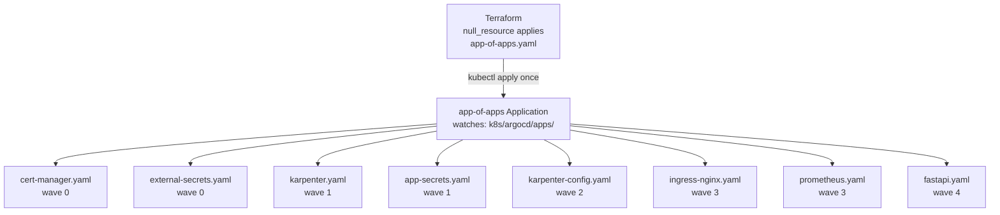

# k8s/argocd/ — GitOps Root

This directory contains the ArgoCD root configuration. The single `app-of-apps.yaml` bootstraps the entire cluster by pointing ArgoCD at the `apps/` subdirectory.

---

## Directory Structure

```
argocd/
├── app-of-apps.yaml   ← The ONE manifest Terraform applies; it bootstraps everything else
└── apps/              ← One Application YAML per tool/service (see apps/README.md)
```

---

## `app-of-apps.yaml` — Line-by-Line

```yaml
apiVersion: argoproj.io/v1alpha1
kind: Application               # ArgoCD custom resource
metadata:
  name: app-of-apps             # Name shown in ArgoCD UI
  namespace: argocd             # ArgoCD always manages its own resources in this namespace
  finalizers:
    - resources-finalizer.argocd.argoproj.io
    # When this Application is deleted, ArgoCD also deletes all child Applications
    # and their managed resources. Remove finalizer to orphan resources on delete.
spec:
  project: default              # ArgoCD project — "default" has no access restrictions
  source:
    repoURL: ${GIT_REPOSITORY_URL}
    # This ${} placeholder is replaced by envsubst in helm-argocd.tf before kubectl apply.
    # The actual value comes from var.git_repository_url in Terraform.

    targetRevision: HEAD        # Always sync from the latest commit on the default branch
    path: k8s/argocd/apps       # ArgoCD reads ALL .yaml files in this directory
    # Any YAML file dropped here becomes a managed Application automatically.
  destination:
    server: https://kubernetes.default.svc
    # "kubernetes.default.svc" means: deploy to the SAME cluster ArgoCD is running in.
    # For multi-cluster setups, register external clusters and use their API server URLs.
    namespace: argocd           # The child Applications themselves live in argocd namespace
  syncPolicy:
    automated:
      prune: true               # Delete child Applications removed from Git
      selfHeal: true            # Re-sync if someone manually edits an Application in-cluster
    retry:
      limit: 10                 # Retry up to 10 times on transient failures
      backoff:
        duration: 10s           # Wait 10s before first retry
        factor: 2               # Double wait each retry: 10s, 20s, 40s, 80s...
        maxDuration: 3m         # Cap at 3 minutes between retries
    syncOptions:
      - CreateNamespace=true    # Create the argocd namespace if it doesn't exist
      - ApplyOutOfSyncOnly=true # Only apply resources that differ from Git (faster sync)
```

---

## How App of Apps Works



**Key insight:** Terraform only touches the cluster twice:
1. `helm install argocd`
2. `kubectl apply app-of-apps.yaml`

After that, every change goes through Git → ArgoCD sync.

---

## Adding a New Tool

```bash
# 1. Create the Application YAML
cat > k8s/argocd/apps/my-new-tool.yaml << EOF
apiVersion: argoproj.io/v1alpha1
kind: Application
metadata:
  name: my-new-tool
  namespace: argocd
  annotations:
    argocd.argoproj.io/sync-wave: "3"
spec:
  project: default
  source:
    repoURL: https://charts.example.io
    chart: my-chart
    targetRevision: "1.0.0"
  destination:
    server: https://kubernetes.default.svc
    namespace: my-namespace
  syncPolicy:
    automated:
      prune: true
      selfHeal: true
    syncOptions:
      - CreateNamespace=true
EOF

# 2. Push to Git
git add k8s/argocd/apps/my-new-tool.yaml
git commit -m "add my-new-tool"
git push

# ArgoCD detects the new file within 3 minutes and installs it automatically.
# No Terraform changes needed.
```
