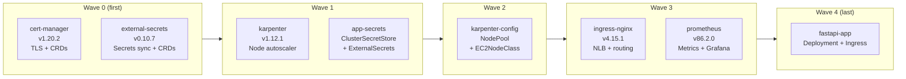

# k8s/argocd/apps/ — Application Definitions

Each file here is an ArgoCD `Application` resource. The root `app-of-apps` Application watches this directory — any file added here gets deployed automatically.

---

## Sync Wave Boot Sequence



ArgoCD waits for all resources in a wave to be **Healthy** before starting the next wave.

---

## File-by-File Reference

### `cert-manager.yaml` — Wave 0

```yaml
source:
  repoURL: https://charts.jetstack.io   # Official cert-manager Helm repo
  chart: cert-manager
  targetRevision: "v1.20.2"            # Pinned version

  helm.parameters:
    - name: crds.enabled
      value: "true"
      # Installs CRDs (Certificate, ClusterIssuer, Issuer, CertificateRequest)
      # alongside the chart. Required — CRDs are not included in the chart by default.

destination:
  namespace: cert-manager               # Dedicated namespace (isolated from app workloads)

syncOptions:
  - ServerSideApply=true                # CRDs are large; SSA avoids annotation size limits
```

**What cert-manager enables:** Automatic TLS certificate issuance from Let's Encrypt.
After installing, create a `ClusterIssuer` resource to start issuing certs.

---

### `external-secrets.yaml` — Wave 0

```yaml
source:
  repoURL: https://charts.external-secrets.io
  chart: external-secrets
  targetRevision: "0.10.7"

  helm.parameters:
    - name: installCRDs
      value: "true"
      # Installs ExternalSecret, SecretStore, ClusterSecretStore CRDs

    - name: serviceAccount.create
      value: "false"
      # DO NOT create the SA — Terraform already created it (iam-external-secrets.tf)
      # with the IRSA annotation. If the chart creates its own SA, it won't have
      # the annotation and ESO won't be able to authenticate to AWS.

    - name: serviceAccount.name
      value: "external-secrets"
      # Reuse the Terraform-managed SA with the IRSA annotation

destination:
  namespace: external-secrets
  # Pre-created by Terraform (kubernetes_namespace_v1.external_secrets)

syncOptions:
  - CreateNamespace=false               # Namespace already exists — don't overwrite it
```

---

### `karpenter.yaml` — Wave 1

```yaml
source:
  repoURL: oci://public.ecr.aws/karpenter
  # OCI artifact — not a standard HTTP Helm repo.
  # Must be pre-registered in ArgoCD (done in helm-argocd.tf).

  chart: karpenter
  targetRevision: "1.12.1"

  helm.parameters:
    - name: settings.clusterName
      value: karpenter-demo
      # Karpenter must know which cluster it belongs to (used in API calls to EKS)

    - name: settings.interruptionQueue
      value: karpenter-demo
      # SQS queue name for Spot interruption notices.
      # The karpenter module in Terraform creates this queue.

    - name: controller.resources.requests/limits.cpu
      value: "1"
    - name: controller.resources.requests/limits.memory
      value: "1Gi"
      # Fixed resources: Karpenter controller runs on system nodes (not Karpenter nodes)

    - name: serviceAccount.name
      value: karpenter
      # Chart creates this SA. Pod Identity maps (kube-system, karpenter) → IAM role.
      # No annotation needed — EKS injects credentials automatically.

destination:
  namespace: kube-system                # Karpenter runs alongside other system components

syncOptions:
  - ServerSideApply=true                # Avoids conflicts with Karpenter's own CRD management
```

---

### `app-secrets.yaml` — Wave 1

```yaml
source:
  path: k8s/secrets                     # Kustomize directory

destination:
  namespace: fastapi                    # Default namespace, but ExternalSecret overrides per-resource

syncOptions:
  - ServerSideApply=true                # ClusterSecretStore is cluster-scoped; SSA handles it cleanly
```

Applies `ClusterSecretStore` (cluster-scoped — no namespace) and `ExternalSecret` (namespace=fastapi).

---

### `karpenter-config.yaml` — Wave 2

```yaml
source:
  path: k8s/karpenter-config            # Kustomize directory
  # Applies: ec2nodeclass.yaml + nodepool.yaml

destination:
  namespace: kube-system

syncOptions:
  - ServerSideApply=true
  # EC2NodeClass and NodePool are CRDs. SSA prevents field ownership conflicts
  # between ArgoCD and the Karpenter controller (which also manages these objects).
```

---

### `ingress-nginx.yaml` — Wave 3

```yaml
source:
  repoURL: https://kubernetes.github.io/ingress-nginx
  chart: ingress-nginx
  targetRevision: "4.15.1"             # ⚠️ FINAL release — project is EOL (March 2026)

  helm.parameters:
    - name: controller.service.type
      value: LoadBalancer
      # Creates an AWS NLB (Network Load Balancer) in front of NGINX

    - name: controller.service.annotations.service\.beta\.kubernetes\.io/aws-load-balancer-type
      value: nlb
      # Explicitly request an NLB (Layer 4) instead of Classic ELB.
      # The double-escaped dot (\.) is required in Helm parameter names.

destination:
  namespace: ingress-nginx
```

---

### `prometheus.yaml` — Wave 3

```yaml
source:
  repoURL: https://prometheus-community.github.io/helm-charts
  chart: kube-prometheus-stack         # Bundles: Prometheus + Grafana + Alertmanager
  targetRevision: "86.2.0"

  helm.parameters:
    - name: prometheus.prometheusSpec.storageSpec
      value: ""
      # Disabled persistent storage (demo only).
      # In production: set a PVC for Prometheus data retention.

    - name: grafana.adminPassword
      value: "changeme"
      # ⚠️ Change in production! Use an ExternalSecret to inject from Secrets Manager.

destination:
  namespace: monitoring
```

---

### `fastapi.yaml` — Wave 4

```yaml
source:
  path: k8s/fastapi                    # Plain manifests — no Helm, no Kustomize
  # ArgoCD applies: namespace.yaml, deployment.yaml, service.yaml, ingress.yaml

destination:
  namespace: fastapi

syncPolicy:
  syncOptions:
    - CreateNamespace=true             # Create "fastapi" namespace if it doesn't exist
    # Note: namespace.yaml also creates it with proper labels.
    # CreateNamespace=true is a fallback in case the manifest fails.
```

---

## Common Operations

### Upgrade a Helm chart version
```bash
# Edit the targetRevision field:
# k8s/argocd/apps/prometheus.yaml: targetRevision: "87.0.0"
git commit -am "upgrade prometheus to 87.0.0"
git push
# ArgoCD detects the change and runs helm upgrade automatically
```

### Check sync status
```bash
kubectl get applications -n argocd
# NAME               SYNC STATUS   HEALTH STATUS
# cert-manager       Synced        Healthy
# external-secrets   Synced        Healthy
# karpenter          Synced        Healthy
# ...
```

### Force a re-sync
```bash
argocd app sync karpenter-config
# or click "Sync" in the ArgoCD UI
```
