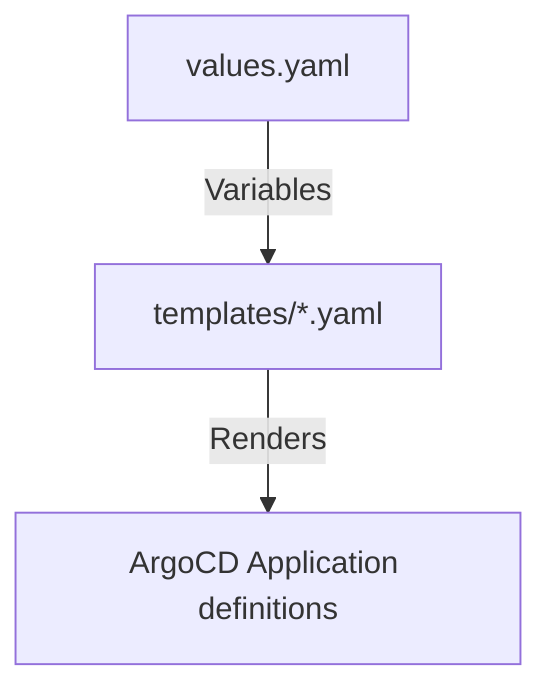

# k8s/argocd/apps Folder Reference

## Purpose
This folder owns the parent Helm chart that configures the individual child applications managed by ArgoCD. It handles parameters pass-through (Git repository URL, EKS cluster name, and region) to each template.

## File-by-file explanation

### [Chart.yaml](file:///home/selva/Documents/k8s/karpenter_simple_example/k8s/argocd/apps/Chart.yaml)
Specifies chart metadata.

- > `apiVersion: v2`
  > Declares compatibility with Helm 3.x specifications.

- > `name: argocd-apps`
  > Chart name identifier.

- > `version: 1.0.0`
  > Chart version tag.

---

### [values.yaml](file:///home/selva/Documents/k8s/karpenter_simple_example/k8s/argocd/apps/values.yaml)
Defines default values for parameters injected by `app-of-apps.yaml` during bootstrap.

- > `repoURL: ""`
  > Git repository source URL. Defaults to empty; must be configured by the root application parameters override to fetch child templates. If wrong, child apps won't load directories.

- > `clusterName: ""`
  > EKS cluster name identifier. Used by Karpenter node discovery configurations (matches `cluster_name` in [variables.tf](file:///home/selva/Documents/k8s/karpenter_simple_example/terraform/variables.tf#L24)).

- > `awsRegion: ""`
  > AWS Region target. Defaults to empty; configured by root application parameter mapping (matches `aws_region` in [variables.tf](file:///home/selva/Documents/k8s/karpenter_simple_example/terraform/variables.tf#L18)).

---

## Architecture
The value fields declared in `values.yaml` are injected into child templates inside the `templates/` folder during rendering.



## Versions & APIs used
- **Helm API Version**: `v2`

## Prerequisites
- Helm `3.17+` installed.

## Commands
### 1. View rendered templates locally
```bash
helm template k8s/argocd/apps
```

## Troubleshooting
### 1. Rendering returns empty parameter values
- **Cause**: The override settings in `app-of-apps.yaml` are missing or misconfigured.
- **Fix**: Check `spec.source.helm.parameters` inside the applied `app-of-apps.yaml` file.

### 2. Chart lint errors
- **Cause**: Malformed values key or indentation error in templates.
- **Fix**: Run `helm lint k8s/argocd/apps` to find error location.

## Official doc links
- [Helm Chart Structure Reference Guide](https://helm.sh/docs/topics/charts/)
