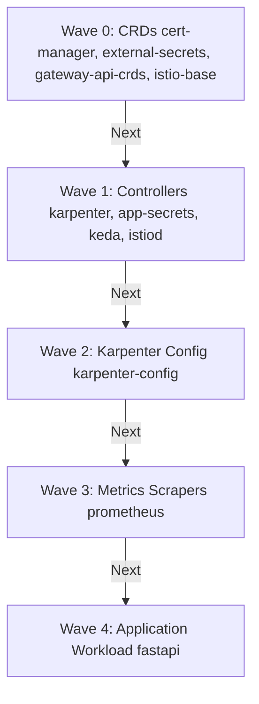

# k8s/argocd/apps/templates Folder Reference

## Purpose
This folder owns the ArgoCD Application custom resources. Each resource configures a specific deployment target, specifying sync policies, target namespaces, and Helm/Git sources.

## File-by-file explanation

All files in this folder are ArgoCD `Application` manifests (`apiVersion: argoproj.io/v1alpha1`, `kind: Application`). Key parameters are detailed below.

### [cert-manager.yaml](file:///home/selva/Documents/k8s/karpenter_simple_example/k8s/argocd/apps/templates/cert-manager.yaml)
Installs cert-manager controller.
- > `argocd.argoproj.io/sync-wave: "0"`
  > Sync wave 0. Installed early so it can manage cert-based webhooks for subsequent applications.
- > `repoURL: https://charts.jetstack.io`
  > Official Jetstack Helm repository path.
- > `chart: cert-manager`
  > Target chart.
- > `targetRevision: v1.17.0`
  > Target stable version pin.
- > `installCRDs: "true"`
  > Enables automatic installation of custom resource definitions.
- > `namespace: cert-manager`
  > Targets isolated `cert-manager` namespace.

---

### [external-secrets.yaml](file:///home/selva/Documents/k8s/karpenter_simple_example/k8s/argocd/apps/templates/external-secrets.yaml)
Installs External Secrets Operator.
- > `argocd.argoproj.io/sync-wave: "0"`
  > Sync wave 0. Installs CRDs so `ExternalSecret` templates can load in sync wave 1.
- > `repoURL: https://charts.external-secrets.io`
  > Official operator Helm repository.
- > `targetRevision: 0.14.2`
  > Target version pin.
- > `namespace: external-secrets`
  > Targets deployment to `external-secrets` namespace (matches namespace in [iam-external-secrets.tf](file:///home/selva/Documents/k8s/karpenter_simple_example/terraform/iam-external-secrets.tf#L73)).

---

### [gateway-api-crds.yaml](file:///home/selva/Documents/k8s/karpenter_simple_example/k8s/argocd/apps/templates/gateway-api-crds.yaml)
Installs Gateway API CRDs.
- > `argocd.argoproj.io/sync-wave: "0"`
  > Sync wave 0. Must run before Istio components or fastapi configurations are deployed.
- > `repoURL: https://kubernetes-sigs.github.io/gateway-api`
  > Official SIGs Helm repository.
- > `targetRevision: 1.2.1`
  > Target version pin.

---

### [istio-base.yaml](file:///home/selva/Documents/k8s/karpenter_simple_example/k8s/argocd/apps/templates/istio-base.yaml)
Installs Istio Base CRDs.
- > `argocd.argoproj.io/sync-wave: "0"`
  > Sync wave 0. Installs baseline configurations for Istiod.
- > `repoURL: https://istio-release.storage.googleapis.com/charts`
  > Official Istio release storage registry.
- > `chart: base`
  > Base CRD configurations chart.
- > `targetRevision: 1.30.1`
  > Target version pin.

---

### [app-secrets.yaml](file:///home/selva/Documents/k8s/karpenter_simple_example/k8s/argocd/apps/templates/app-secrets.yaml)
Applies local Secrets Store configurations.
- > `argocd.argoproj.io/sync-wave: "1"`
  > Sync wave 1. Runs after ESO is running (wave 0) so CRDs are recognized.
- > `path: k8s/secrets`
  > Local folder path containing manifests.
- > `namespace: fastapi`
  > Targets FastAPI namespace.

---

### [istiod.yaml](file:///home/selva/Documents/k8s/karpenter_simple_example/k8s/argocd/apps/templates/istiod.yaml)
Installs Istiod control plane.
- > `argocd.argoproj.io/sync-wave: "1"`
  > Sync wave 1. Installs after base CRDs are running (wave 0).
- > `repoURL: https://istio-release.storage.googleapis.com/charts`
  > Target chart registry.
- > `chart: istiod`
  > Target control plane container.
- > `targetRevision: 1.30.1`
  > Matches base chart version pin. If versions mismatch, mesh features may degrade.
- > `global.proxy.autoInject: enabled`
  > Enables automatic envoy sidecar injection in labeled namespaces.

---

### [karpenter.yaml](file:///home/selva/Documents/k8s/karpenter_simple_example/k8s/argocd/apps/templates/karpenter.yaml)
Installs Karpenter controller.
- > `argocd.argoproj.io/sync-wave: "1"`
  > Sync wave 1. Runs after IAM roles and instance profiles exist.
- > `repoURL: oci://public.ecr.aws/karpenter`
  > Karpenter OCI registry distribution channel.
- > `targetRevision: 1.13.0`
  > Version pin.
- > `settings.clusterName: {{ .Values.clusterName | quote }}`
  > Passes target EKS cluster name (matches `cluster_name` in [variables.tf](file:///home/selva/Documents/k8s/karpenter_simple_example/terraform/variables.tf#L24)).
- > `settings.interruptionQueue: {{ .Values.clusterName | quote }}`
  > Passes SQS queue identifier for EKS spot interruption events.
- > `namespace: kube-system`
  > Deploys to system namespace.

---

### [keda.yaml](file:///home/selva/Documents/k8s/karpenter_simple_example/k8s/argocd/apps/templates/keda.yaml)
Installs KEDA operator.
- > `argocd.argoproj.io/sync-wave: "1"`
  > Sync wave 1. Runs after base metrics controllers are set up.
- > `repoURL: https://kedacore.github.io/charts`
  > Official KEDA Helm repository.
- > `targetRevision: 2.20.1`
  > Version pin.
- > `webhooks.enabled: "true"`
  > Enables validation webhooks.
- > `serviceAccount.name: keda-operator`
  > SA name for identity routing.

---

### [karpenter-config.yaml](file:///home/selva/Documents/k8s/karpenter_simple_example/k8s/argocd/apps/templates/karpenter-config.yaml)
Applies Karpenter NodePool configuration.
- > `argocd.argoproj.io/sync-wave: "2"`
  > Sync wave 2. Runs after Karpenter CRDs are registered (wave 1).
- > `path: k8s/karpenter-config`
  > Local folder path.

---

### [prometheus.yaml](file:///home/selva/Documents/k8s/karpenter_simple_example/k8s/argocd/apps/templates/prometheus.yaml)
Installs Prometheus stack.
- > `argocd.argoproj.io/sync-wave: "3"`
  > Sync wave 3. Runs after Karpenter can provision capacity (wave 2) so Prometheus and Grafana pods have worker nodes to schedule onto.
- > `repoURL: https://prometheus-community.github.io/helm-charts`
  > Official Prometheus Helm repository.
- > `chart: kube-prometheus-stack`
  > Core community chart.
- > `targetRevision: 69.7.2`
  > Version pin.
- > `namespace: monitoring`
  > Targets `monitoring` namespace.

---

### [fastapi.yaml](file:///home/selva/Documents/k8s/karpenter_simple_example/k8s/argocd/apps/templates/fastapi.yaml)
Deploys the FastAPI microservice workload.
- > `argocd.argoproj.io/sync-wave: "4"`
  > Sync wave 4. Workloads deploy last, ensuring secret synchronizers, mesh proxies, and scaling triggers are running.
- > `path: k8s/fastapi`
  > Local path containing Helm templates.
- > `namespace: fastapi`
  > Target namespace.

---

## Architecture
The templates run sequentially via the sync-wave metadata annotation:



## Versions & APIs used
- **ArgoCD Application API**: `argoproj.io/v1alpha1`

## Prerequisites
- Parent App of Apps manifest deployed.
- Cluster OCI configurations registered.

## Commands
### 1. View rendered manifests
```bash
helm template k8s/argocd/apps
```

## Troubleshooting
### 1. Karpenter template fails to load OCI registry
- **Cause**: Out-of-date Helm client or local EKS network blocking.
- **Fix**: Check `helm-argocd.tf` is configuring the `public.ecr.aws/karpenter` OCI repository correctly.

### 2. Application stuck in OutOfSync due to conflicting field specifications
- **Cause**: The live cluster holds fields managed by operator mutation loops.
- **Fix**: Configure `syncOptions` to ignore mutation target fields.

## Official doc links
- [ArgoCD Synchronization Waves Concepts](https://argo-cd.readthedocs.io/en/stable/user-guide/sync-waves/)
