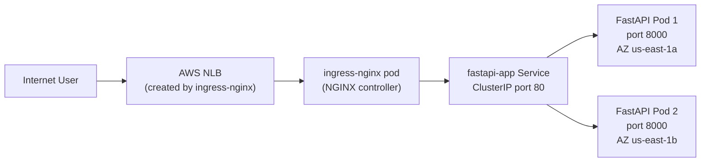

# k8s/fastapi/ — Application Manifests

Plain Kubernetes manifests for the FastAPI application. Applied by ArgoCD at **sync wave 4** — last, after all infrastructure is ready.

No Helm, no Kustomize. ArgoCD applies all `.yaml` files in this directory as-is.

---

## Files

| File | Kind | Description |
|---|---|---|
| `namespace.yaml` | Namespace | Creates the `fastapi` namespace |
| `deployment.yaml` | Deployment | Runs 2 FastAPI replicas on Karpenter nodes |
| `service.yaml` | Service | ClusterIP: port 80 → pod port 8000 |
| `ingress.yaml` | Ingress | Routes external traffic via ingress-nginx |

---

## Traffic Flow



---

## `namespace.yaml` — Line-by-Line

```yaml
apiVersion: v1
kind: Namespace
metadata:
  name: fastapi                  # All FastAPI resources live here
  labels:
    app: fastapi                 # Label for NetworkPolicy and monitoring selectors
```

Why a dedicated namespace? Namespace = isolation boundary. Enables resource quotas, RBAC scoped to this app, and NetworkPolicies to restrict inter-service traffic.

---

## `deployment.yaml` — Line-by-Line

```yaml
apiVersion: apps/v1
kind: Deployment
metadata:
  name: fastapi-app
  namespace: fastapi
  labels:
    app: fastapi-app             # Used by Service selector to find these pods

spec:
  replicas: 2                    # 2 instances for high availability
  selector:
    matchLabels:
      app: fastapi-app           # Must match template.metadata.labels below

  template:
    metadata:
      labels:
        app: fastapi-app         # Pods get this label; Service uses it to route traffic

    spec:
      # No nodeSelector or tolerations for system taint here.
      # System nodes have taint CriticalAddonsOnly=true:NoSchedule.
      # This pod does NOT tolerate it → can only run on Karpenter-provisioned nodes.
      # When pods are Pending (no node available), Karpenter detects and provisions one.

      containers:
        - name: fastapi
          image: 961445532924.dkr.ecr.us-east-1.amazonaws.com/fastapi-app:latest
          # Replace ACCOUNT_ID and region with yours.
          # In CI/CD: GitHub Actions builds, pushes with git SHA tag, updates this field via sed.

          imagePullPolicy: Always
          # Always pull from ECR even if image:latest is cached.
          # Ensures latest code is always used. For pinned SHA tags, use IfNotPresent.

          ports:
            - containerPort: 8000    # uvicorn listens on 8000
              name: http             # Named port — referenced by Service targetPort

          env:
            - name: POD_NAME
              valueFrom:
                fieldRef:
                  fieldPath: metadata.name
              # Injects the pod's own name as an env var.
              # Shown in the API response at GET / (useful for debugging which pod served you).

            - name: NODE_NAME
              valueFrom:
                fieldRef:
                  fieldPath: spec.nodeName
              # Injects the EC2 instance hostname the pod is running on.
              # Shown in the API response — helps verify Karpenter provisioned a new node.

            - name: GOOGLE_API_KEY
              valueFrom:
                secretKeyRef:
                  name: google-api-key
                  # K8s Secret created by ESO from AWS Secrets Manager.
                  # See k8s/secrets/google-api-key.yaml
                  key: GOOGLE_API_KEY
              # The app reads this as os.getenv("GOOGLE_API_KEY").
              # If the Secret doesn't exist, the pod fails with CreateContainerConfigError.

          resources:
            requests:
              cpu: "250m"            # 0.25 vCPU guaranteed. Karpenter uses this for bin-packing.
              memory: "256Mi"        # 256 MB guaranteed.
            limits:
              cpu: "500m"            # Burst to 0.5 vCPU max. Pod is throttled above this.
              memory: "512Mi"        # Pod is OOMKilled if it exceeds this.
            # Karpenter uses REQUESTS (not limits) to select instance size.
            # 2 pods × 250m = 500m CPU needed → Karpenter picks e.g. m5.large (2 vCPU)

          readinessProbe:
            httpGet:
              path: /health          # FastAPI endpoint: returns {"status": "healthy"}
              port: 8000
            initialDelaySeconds: 5   # Wait 5s after container starts before first check
            periodSeconds: 10        # Check every 10s
            # Pod only receives traffic when this probe passes.
            # During rolling updates, old pods serve traffic until new ones are ready.

          livenessProbe:
            httpGet:
              path: /health
              port: 8000
            initialDelaySeconds: 10  # More generous delay for liveness (app must fully start)
            periodSeconds: 30        # Check every 30s
            # If this fails 3 times (default), kubelet restarts the container.
            # Handles hung processes that stop responding without exiting.

      topologySpreadConstraints:
        - maxSkew: 1                       # Allow at most 1 more pod in one AZ than another
          topologyKey: topology.kubernetes.io/zone  # Spread across AZs
          whenUnsatisfiable: DoNotSchedule         # Don't schedule if constraint can't be met
          labelSelector:
            matchLabels:
              app: fastapi-app
          # Ensures the 2 replicas land in different AZs.
          # If us-east-1a fails, us-east-1b pod still serves traffic.
```

---

## `service.yaml` — Line-by-Line

```yaml
apiVersion: v1
kind: Service
metadata:
  name: fastapi-app
  namespace: fastapi

spec:
  type: ClusterIP            # Only accessible within the cluster (no external IP)
  # External access is handled by the Ingress → ingress-nginx → NLB.

  selector:
    app: fastapi-app         # Routes to pods with this label (set in deployment.yaml)
    # Kubernetes watches pod readiness. Unhealthy pods are automatically removed
    # from the Endpoints list — no traffic is sent to failing pods.

  ports:
    - name: http
      port: 80               # Port the Service listens on
      targetPort: 8000       # Port on the pod (uvicorn)
      # External: GET http://fastapi-app.fastapi.svc.cluster.local:80/
      # → Pod: port 8000
```

---

## `ingress.yaml` — Line-by-Line

```yaml
apiVersion: networking.k8s.io/v1
kind: Ingress
metadata:
  name: fastapi-app
  namespace: fastapi
  annotations:
    # (ALB annotations are commented out — use ingress-nginx for now)
    # alb.ingress.kubernetes.io/scheme: internet-facing
    # alb.ingress.kubernetes.io/target-type: ip
    # alb.ingress.kubernetes.io/certificate-arn: arn:aws:acm:...

spec:
  ingressClassName: nginx        # Modern replacement for kubernetes.io/ingress.class annotation
  # Must match the IngressClass registered by ingress-nginx (default: "nginx")

  rules:
    - host: fastapi.example.com  # Replace with your actual domain
      http:
        paths:
          - path: /
            pathType: Prefix     # Match / and everything under it (/health, /api/...)
            backend:
              service:
                name: fastapi-app     # Routes to the Service above
                port:
                  name: http          # Uses named port (port 80 → pod 8000)
```

**To enable HTTPS with cert-manager:**
```yaml
metadata:
  annotations:
    cert-manager.io/cluster-issuer: letsencrypt-prod
spec:
  tls:
    - hosts:
        - fastapi.example.com
      secretName: fastapi-tls
```

---

## CI/CD Image Update Flow

GitHub Actions updates the image tag on every push to `main`:

```
git push to main
→ GitHub Actions: docker build + push to ECR with git SHA tag
→ GitHub Actions: sed -i 's|image: .*|image: ACCOUNT.dkr.ecr.../fastapi-app:SHA|' deployment.yaml
→ GitHub Actions: git commit + push
→ ArgoCD: detects deployment.yaml changed
→ ArgoCD: kubectl apply → rolling update (zero downtime)
```

---

## Verify Deployment

```bash
# Check pods are running
kubectl get pods -n fastapi
# NAME                           READY   STATUS    RESTARTS   AGE
# fastapi-app-6d4f9b7c8d-xk2p9   1/1     Running   0          5m
# fastapi-app-6d4f9b7c8d-9mnt4   1/1     Running   0          5m

# Check which nodes pods landed on (should be Karpenter nodes, not system nodes)
kubectl get pods -n fastapi -o wide

# Hit the API
kubectl port-forward svc/fastapi-app -n fastapi 8080:80
curl http://localhost:8080/
# {"message": "Hello from FastAPI on EKS with Karpenter!", "node": "ip-10-0-1-42...", "pod": "fastapi-app-6d4f9b7c8d-xk2p9"}

# Check the secret is loaded
kubectl exec -n fastapi deploy/fastapi-app -- env | grep GOOGLE_API_KEY
```
