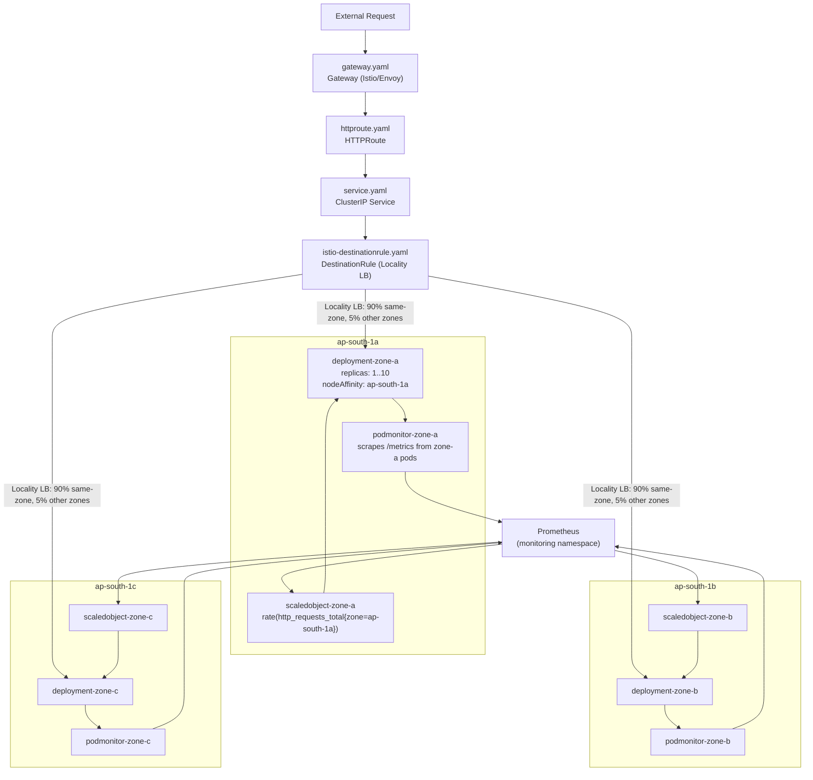

# k8s/fastapi/ — Zone-Aware FastAPI Manifests

Three independent per-zone stacks (Deployment + PodMonitor + ScaledObject) plus shared networking. Applied by ArgoCD at **sync wave 4** via Kustomize.

---

## Files

| File | Kind | Zone | Description |
|---|---|---|---|
| `namespace.yaml` | Namespace | — | Creates the `fastapi` namespace |
| `deployment-zone-a.yaml` | Deployment | ap-south-1a | nodeAffinity hard-locked to ap-south-1a |
| `deployment-zone-b.yaml` | Deployment | ap-south-1b | nodeAffinity hard-locked to ap-south-1b |
| `deployment-zone-c.yaml` | Deployment | ap-south-1c | nodeAffinity hard-locked to ap-south-1c |
| `podmonitor-zone-a.yaml` | PodMonitor | ap-south-1a | Prometheus scrapes zone-a pods directly |
| `podmonitor-zone-b.yaml` | PodMonitor | ap-south-1b | Prometheus scrapes zone-b pods directly |
| `podmonitor-zone-c.yaml` | PodMonitor | ap-south-1c | Prometheus scrapes zone-c pods directly |
| `scaledobject-zone-a.yaml` | ScaledObject | ap-south-1a | KEDA scales zone-a by zone-a request rate |
| `scaledobject-zone-b.yaml` | ScaledObject | ap-south-1b | KEDA scales zone-b by zone-b request rate |
| `scaledobject-zone-c.yaml` | ScaledObject | ap-south-1c | KEDA scales zone-c by zone-c request rate |
| `service.yaml` | Service | — | Aggregate ClusterIP service |
| `gateway.yaml` | Gateway | — | Gateway API Gateway (auto-provisions NLB + Envoy pod via Istio) |
| `httproute.yaml` | HTTPRoute | — | Gateway API HTTPRoute routing rule |
| `istio-destinationrule.yaml` | DestinationRule | — | Istio DestinationRule (locality-aware routing + circuit breaking) |

---

## Architecture



---

## Traffic Flow (Locality-Aware Routing)

```
Request arrives at Gateway (Envoy) pod in ap-south-1a
  → Gateway (Envoy) → fastapi-app Service
  → DestinationRule Locality LB → routes to same-zone endpoint (90% weight)
  → fastapi-app-zone-a pod (running in ap-south-1a)
  → Response travels back within ap-south-1a

90% of traffic remains local to the AZ, minimizing cross-AZ data transfer costs.
```

---

## Scaling Flow Per Zone

```
1. fastapi-app-zone-a pod serves requests
2. prometheus-fastapi-instrumentator increments http_requests_total{zone="ap-south-1a"}
3. Prometheus scrapes /metrics via podmonitor-zone-a every 15s
4. KEDA polls Prometheus every 30s:
     query: sum(rate(http_requests_total{namespace="fastapi", zone="ap-south-1a"}[1m]))
5. KEDA computes: desired_replicas = ceil(req_per_sec / 10)
6. KEDA drives HPA → adjusts deployment-zone-a replica count
7. Karpenter sees Pending pods with nodeAffinity=ap-south-1a
8. Karpenter launches EC2 instance in ap-south-1a (~60s)
9. Pod schedules, serves traffic
```

Zones A, B, C scale **independently** — a spike in ap-south-1b does not affect zone-a or zone-c replica counts.

---

## Locality-Aware Routing Configuration

Locality-aware routing is handled at the Envoy proxy level using Istio's `DestinationRule` instead of native `trafficDistribution: PreferClose` because it integrates with retries, outlier detection, and failover budgets.

See: [istio-destinationrule.yaml](file:///home/selva/Documents/k8s/karpenter_simple_example/k8s/fastapi/istio-destinationrule.yaml)

---

## `podmonitor-zone-{a,b,c}.yaml` — Why PodMonitor, Not ServiceMonitor

| | ServiceMonitor | PodMonitor |
|---|---|---|
| Scrapes via | Service (load-balanced) | Pod IP directly |
| Per-pod labels | Lost (load-balanced away) | Preserved |
| Zone label in metrics | ✗ No | ✓ Yes (via relabeling) |
| KEDA query can filter by zone | ✗ No | ✓ Yes |

PodMonitor relabeling copies the pod label `zone: ap-south-1a` into every scraped metric. Without this, `http_requests_total{zone="ap-south-1a"}` would return nothing in Prometheus.

The PodMonitors live in the `monitoring` namespace (where Prometheus Operator is installed). Prometheus discovers them because `kube-prometheus-stack` is configured with `podMonitorNamespaceSelector: {}` (see `k8s/argocd/apps/prometheus.yaml`).

---

## `scaledobject-zone-{a,b,c}.yaml` — Scaling Parameters

| Parameter | Value | Meaning |
|---|---|---|
| `minReplicaCount` | 1 | Always 1 pod per zone — zone stays warm, no cold start |
| `maxReplicaCount` | 10 | Cap at 10 pods per zone |
| `threshold` | 10 | 1 pod per 10 req/s. 50 req/s → 5 pods |
| `activationThreshold` | 1 | Ignore health-check noise (< 1 req/s) |
| `metricName` | `http_rps_zone_{a,b,c}` | **Must be unique per ScaledObject** — HPA uses this as the metric name |
| `pollingInterval` | 30s | KEDA queries Prometheus every 30 seconds |
| `cooldownPeriod` | 120s | Wait 2 min of low traffic before scaling down |

---

## Verify Everything Is Working

```bash
# Pods — 3 deployments, 1 pod each by default
kubectl get pods -n fastapi -L zone
# NAME                         READY   ZONE
# fastapi-app-zone-a-xxx       1/1     ap-south-1a
# fastapi-app-zone-b-xxx       1/1     ap-south-1b
# fastapi-app-zone-c-xxx       1/1     ap-south-1c

# Nodes — each pod on a node in its zone
kubectl get pods -n fastapi -o wide

# ScaledObjects — READY=True means KEDA is connected to Prometheus
kubectl get scaledobject -n fastapi
# NAME                   SCALETARGETKIND   READY   ACTIVE
# fastapi-app-zone-a     Deployment        True    False
# fastapi-app-zone-b     Deployment        True    False
# fastapi-app-zone-c     Deployment        True    False

# PodMonitors are discovered by Prometheus
kubectl get podmonitor -n monitoring

# Prometheus has the metrics
kubectl port-forward svc/prometheus-kube-prometheus-prometheus -n monitoring 9090:9090
# Query: http_requests_total{namespace="fastapi"}

# Test zone-local routing
kubectl port-forward svc/fastapi-app -n fastapi 8080:80
curl http://localhost:8080/
# {"zone": "ap-south-1a", ...}  ← served by zone-a pod (nginx pod is in 1a)
```
