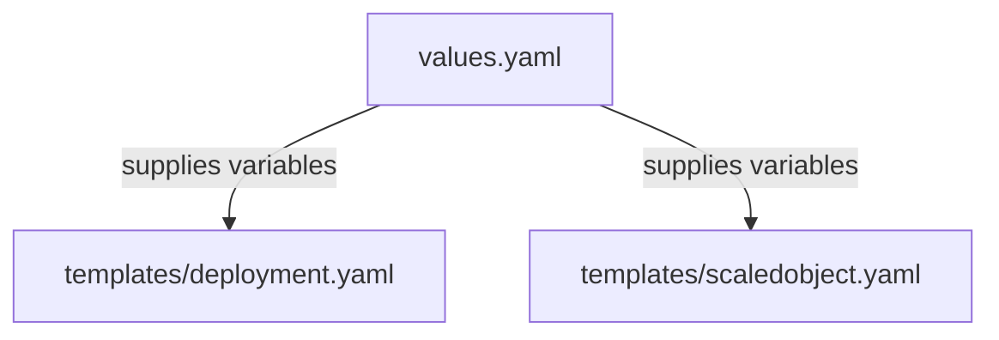

# k8s/fastapi Folder Reference

## Purpose
This folder owns the Helm configuration values for the FastAPI workload. It defines zone parameters, replica capacities, resources requests and limits, and autoscaling thresholds.

## File-by-file explanation

### [Chart.yaml](file:///home/selva/Documents/k8s/karpenter_simple_example/k8s/fastapi/Chart.yaml)
Specifies chart metadata.
- > `apiVersion: v2`
  > Declares compatibility with Helm 3.x specifications.
- > `name: fastapi-app`
  > Chart name identifier.
- > `version: 1.0.0`
  > Chart version tag.

---

### [values.yaml](file:///home/selva/Documents/k8s/karpenter_simple_example/k8s/fastapi/values.yaml)
Specifies configuration values used to render templates.

- > `awsRegion: "ap-south-1"`
  > Directs deployments to AWS Mumbai region. Matches regional boundaries set in [variables.tf](file:///home/selva/Documents/k8s/karpenter_simple_example/terraform/variables.tf#L18).

- > `zones: ["a", "b", "c"]`
  > Declares availability zone suffixes. Renders zone-isolated deployments (e.g. zone-a, zone-b, zone-c) to enforce high availability and local network pathing.

- > `image`
  > Container image configuration.
  - > `repository: ""`
    > Target ECR repository path. Overwritten by GitHub actions CI run (matches `ecr_repository_url` output in [outputs.tf](file:///home/selva/Documents/k8s/karpenter_simple_example/terraform/outputs.tf#L63)).
  - > `tag: "latest"`
    > Image tag pin. Defaults to `"latest"`, updated to the unique commit SHA by the CI pipeline run.
  - > `pullPolicy: "Always"`
    > Pull policy for pods. Enforces fetching updated tags on pod restart.

- > `resources`
  > Allocates pod compute footprint limits.
  - > `requests.cpu: "100m"` / `requests.memory: "128Mi"`
    > Guaranteed allocation for pod scheduling. Low requests allow Karpenter to bundle pods closely on nodes. If set too high, scheduling delays will occur.
  - > `limits.cpu: "200m"` / `limits.memory: "256Mi"`
    > Maximum computing boundaries allowed per container. If memory limit is breached, the container is OOMKilled by the node kernel.

- > `keda`
  > Specifies autoscaling values.
  - > `minReplicas: 1`
    > Minimum active pods per zone. Keeps one pod running per zone to avoid cold start response delays.
  - > `maxReplicas: 10`
    > Maximum allowed pods per zone (total 30 pods across 3 zones). Caps resources footprints to control billing.
  - > `threshold: "10"`
    > Traffic threshold triggering scale-up (10 requests per second per pod). If average traffic rate exceeds this value, KEDA spins up additional replicas.

---

## Architecture
The chart values supply variables to the rendering loop of the template compiler to generate zone-aware resources.



## Versions & APIs used
- **Helm API Version**: `v2`

## Prerequisites
- Helm `3.17+` installed.

## Commands
### 1. View rendered templates
```bash
helm template k8s/fastapi
```

## Troubleshooting
### 1. Pods crash with OOMKilled errors
- **Cause**: Memory limit (`limits.memory: "256Mi"`) is too low for application footprint.
- **Fix**: Increase `limits.memory` in `values.yaml` to `512Mi`.

### 2. Node scheduling blocks due to resource pressure
- **Cause**: CPU requests set too high, exceeding node capacity limits.
- **Fix**: Lower requests values or verify Karpenter NodePool size boundaries.

## Official doc links
- [Helm Chart Values Documentation](https://helm.sh/docs/chart_template_guide/values_files/)
