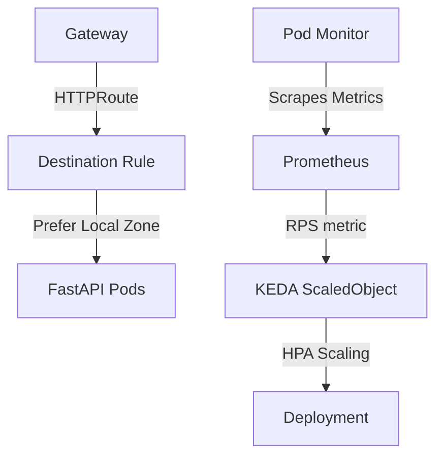

# k8s/fastapi/templates Folder Reference

## Purpose
This folder owns the Kubernetes resource templates for the FastAPI application. It implements zone-isolated deployments, KEDA autoscaling rules, local load balancing, and Prometheus metrics configuration.

## File-by-file explanation

### [deployment.yaml](file:///home/selva/Documents/k8s/karpenter_simple_example/k8s/fastapi/templates/deployment.yaml)
Renders a separate Deployment resource per Availability Zone.

- > `{{- range $zoneSuffix := .Values.zones }}`
  > Iterates over the zones defined in [values.yaml](file:///home/selva/Documents/k8s/karpenter_simple_example/k8s/fastapi/values.yaml#L2) to render zone-specific Deployments. Matches target zones.

- > `metadata.name: fastapi-app-zone-{{ $zoneSuffix }}`
  > Dynamically names the deployment (e.g. `fastapi-app-zone-a`).

- > `spec.replicas: 1`
  > Initial pod replica count. Overwritten at runtime by KEDA's HPA controller.

- > `spec.selector.matchLabels`
  > Identifies pods managed by this Deployment.
  - > `app: fastapi-app` / `zone: {{ $zoneName }}`
    > Labels must match pod template metadata labels exactly.

- > `spec.template.spec.affinity.nodeAffinity`
  > Enforces scheduling rules.
  - > `topology.kubernetes.io/zone`
    > Matches worker node labels. Uses `In` operator with `$zoneName` (e.g., `ap-south-1a`) to force pods to run ONLY on nodes in the matching availability zone. Prevents pods from scheduling in the wrong zone.

- > `spec.template.spec.topologySpreadConstraints`
  > Distributes pods across topology domains.
  - > `topologyKey: kubernetes.io/hostname`
    > Enforces spreading pods across different physical nodes inside the zone, preventing single-node failures from causing downtime.
  - > `whenUnsatisfiable: ScheduleAnyway`
    > Prevents scheduling blocks if only one node is available.

- > `spec.template.spec.containers`
  > Container specification.
  - > `image: "{{ $.Values.image.repository }}:{{ $.Values.image.tag }}"`
    > Target image tag. Updated automatically by the CI pipeline.
  - > `ports.containerPort: 8000`
    > Exposes port 8000. Matches FastAPI port exposed in [Dockerfile](file:///home/selva/Documents/k8s/karpenter_simple_example/app/Dockerfile#L14).
  - > `env`
    > Sets up environment variables.
    - > `POD_NAME` / `NODE_NAME`
      > Uses Downward API to inject pod and hosting node names.
    - > `ZONE: {{ $zoneName }}`
      > Injects local Availability Zone. Used by FastAPI in [main.py](file:///home/selva/Documents/k8s/karpenter_simple_example/app/main.py#L40) to populate response metadata.
    - > `GOOGLE_API_KEY`
      > Injects value from secret `google-api-key`. If missing, the container fails startup check.

- > `readinessProbe` / `livenessProbe`
  > Performs HTTP GET requests on `/health` on port `8000` to monitor container state.

---

### [gateway.yaml](file:///home/selva/Documents/k8s/karpenter_simple_example/k8s/fastapi/templates/gateway.yaml)
Exposes HTTP traffic.

- > `gatewayClassName: istio`
  > Triggers dynamic provisioning of Envoy proxies by Istiod.
- > `listeners.port: 80` / `protocol: HTTP`
  > Exposes port 80 for HTTP connections.
- > `networking.istio.io/service-type: LoadBalancer`
  > Annotation instructing Istio to provision an AWS Network Load Balancer (NLB) in the public subnets tagged `kubernetes.io/role/elb = 1`.

---

### [httproute.yaml](file:///home/selva/Documents/k8s/karpenter_simple_example/k8s/fastapi/templates/httproute.yaml)
Defines routing paths.

- > `parentRefs.name: fastapi-gateway`
  > Binds this route definition to the Gateway resource.
- > `hostnames: ["fastapi.example.com"]`
  > Restricts routing to requests with the host header `fastapi.example.com`.
- > `rules.backendRefs.name: fastapi-app`
  > Routes matched traffic (PathPrefix `/`) to the backend Service.

---

### [istio-destinationrule.yaml](file:///home/selva/Documents/k8s/karpenter_simple_example/k8s/fastapi/templates/istio-destinationrule.yaml)
Traffic policies configuration.

- > `host: fastapi-app.fastapi.svc.cluster.local`
  > Targets the internal Service.
- > `trafficPolicy.loadBalancer.localityLbSetting`
  > Enforces locality-aware routing rules. Configures a `90/5/5` weight split (prefers local zone endpoints, falls back to other zones on failure), avoiding cross-AZ AWS data transfer fees.
- > `trafficPolicy.outlierDetection`
  > Circuit breaker setup. Ejects pods returning `3` consecutive 5xx errors for `30s` (baseEjectionTime) to protect downstream clients.

---

### [scaledobject.yaml](file:///home/selva/Documents/k8s/karpenter_simple_example/k8s/fastapi/templates/scaledobject.yaml)
Autoscale rules per zone.

- > `scaleTargetRef.name: fastapi-app-zone-{{ $zoneSuffix }}`
  > Binds scaling rules to the matching zone deployment.
- > `triggers.type: prometheus`
  > Scrapes metrics from Prometheus.
  - > `query: sum(rate(http_requests_total{namespace="fastapi",zone="{{ $zoneName }}"}[1m]))`
    > Calculates zone-specific request rate per second.
  - > `threshold: {{ $.Values.keda.threshold }}`
    > Targets 10 RPS per pod. Matches `keda.threshold` in [values.yaml](file:///home/selva/Documents/k8s/karpenter_simple_example/k8s/fastapi/values.yaml#L15).
- > `advanced.horizontalPodAutoscalerConfig.behavior`
  > Configures scale-up and scale-down speed (e.g. max scale-up of 3 pods per 30s) to prevent scaling oscillations.

---

### [service.yaml](file:///home/selva/Documents/k8s/karpenter_simple_example/k8s/fastapi/templates/service.yaml)
Aggregation Service.

- > `spec.selector.app: fastapi-app`
  > Selects pods across all zones.
- > `spec.ports.port: 80` / `targetPort: 8000`
  > Maps cluster port 80 to container port 8000.

---

### [namespace.yaml](file:///home/selva/Documents/k8s/karpenter_simple_example/k8s/fastapi/templates/namespace.yaml)
FastAPI Namespace.

- > `labels.istio-injection: enabled`
  > Instructs Istiod to automatically inject Envoy sidecars into pods deployed inside the namespace.

---

### [podmonitor.yaml](file:///home/selva/Documents/k8s/karpenter_simple_example/k8s/fastapi/templates/podmonitor.yaml)
Prometheus metrics registration.

- > `spec.podMetricsEndpoints`
  > Points Prometheus to scrape `/metrics` on target port `http` every `15s`.

---

### [grafana-dashboard-*.yaml](file:///home/selva/Documents/k8s/karpenter_simple_example/k8s/fastapi/templates/grafana-dashboard-fastapi-overview.yaml)
Creates ConfigMaps holding Grafana dashboard JSON models.

- > `labels.grafana_dashboard: "1"`
  > Triggers Grafana's sidecar to auto-discover and import the dashboard.
- > `annotations.grafana_folder: "FastAPI"`
  > Groups dashboards inside a target folder in the Grafana UI.

---

## Architecture
The templates integrate to form the network, metrics, scaling, and scheduling pipelines:



## Versions & APIs used
- **Gateway API**: `gateway.networking.k8s.io/v1`
- **DestinationRule API**: `networking.istio.io/v1`
- **ScaledObject API**: `keda.sh/v1alpha1`
- **PodMonitor API**: `monitoring.coreos.com/v1`

## Prerequisites
- Istio Ingress Controller running.
- Prometheus Operator deployed.
- KEDA controller running.

## Commands
### 1. Dry-run render templates
```bash
helm template k8s/fastapi
```

## Troubleshooting
### 1. Ingress returns `503 Service Unavailable`
- **Cause**: Pod sidecars have not finished starting, or destination rule host targets are incorrect.
- **Fix**: Check `istioctl proxy-config endpoints` and verify destination rule host targets match.

### 2. KEDA fails to scale down
- **Cause**: `cooldownPeriod` is running, or metrics queries return values above thresholds.
- **Fix**: Check queries in Prometheus console to verify matching metrics rates.

## Official doc links
- [Kubernetes Gateway API Reference](https://gateway-api.sigs.k8s.io/)
- [KEDA Autoscaler Concepts Guide](https://keda.sh/docs/concepts/)
