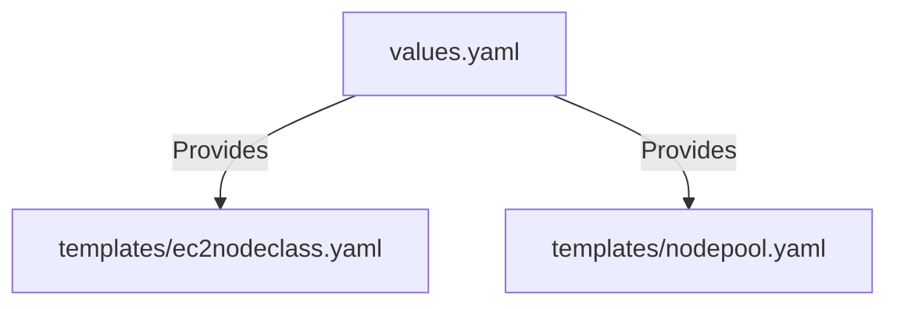

# k8s/karpenter-config Folder Reference

## Purpose
This folder owns the Helm configurations representing node provisioning templates for Karpenter. It wraps parameters used to discover security groups and subnets dynamically.

## File-by-file explanation

### [Chart.yaml](file:///home/selva/Documents/k8s/karpenter_simple_example/k8s/karpenter-config/Chart.yaml)
Specifies chart metadata.
- > `apiVersion: v2`
  > Declares compatibility with Helm 3.x specifications.
- > `name: karpenter-config`
  > Chart name identifier.
- > `version: 1.0.0`
  > Chart version tag.

---

### [values.yaml](file:///home/selva/Documents/k8s/karpenter_simple_example/k8s/karpenter-config/values.yaml)
Defines variables mapping.

- > `clusterName: "karpenter-demo"`
  > Target EKS cluster name. Passed to templates to build tags. Must match `cluster_name` in [variables.tf](file:///home/selva/Documents/k8s/karpenter_simple_example/terraform/variables.tf#L24). If wrong, Karpenter won't find tagged subnets.

---

## Architecture
The values in `values.yaml` are passed to templates to render NodePool and EC2NodeClass configuration manifests.



## Versions & APIs used
- **Helm API Version**: `v2`

## Prerequisites
- Helm `3.17+` installed.

## Commands
### 1. Dry-run render templates
```bash
helm template k8s/karpenter-config
```

## Troubleshooting
### 1. Template validation errors
- **Cause**: Typo or mismatched key in `values.yaml`.
- **Fix**: Check `values.yaml` fields.

### 2. NodeClass fails discovery
- **Cause**: `clusterName` does not match the actual AWS resource tags.
- **Fix**: Check the EKS cluster name in AWS Console and align the variable values.

## Official doc links
- [Helm Value Guidelines](https://helm.sh/docs/chart_best_practices/values/)
