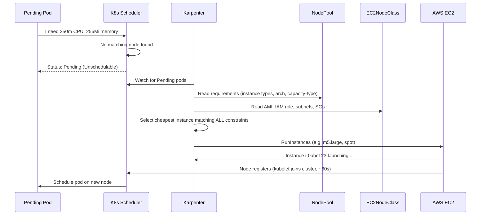

# k8s/karpenter-config/ — NodePool + EC2NodeClass

Applied by ArgoCD as the `karpenter-config` Application at **sync wave 2**. Defines how Karpenter provisions EC2 instances for application workloads.

---

## Files

| File | Kind | Description |
|---|---|---|
| `kustomization.yaml` | Kustomize | Lists resources to apply |
| `ec2nodeclass.yaml` | EC2NodeClass | AWS-specific node config (AMI, IAM role, networking) |
| `nodepool.yaml` | NodePool | Scheduling rules (instance types, limits, consolidation) |

---

## How Karpenter Provisions a Node



---

## `kustomization.yaml` — Line-by-Line

```yaml
apiVersion: kustomize.config.k8s.io/v1beta1
kind: Kustomization        # Kustomize manifest type

resources:
  - ec2nodeclass.yaml      # EC2NodeClass: AWS-specific settings with hardcoded IAM role
  - nodepool.yaml          # NodePool: scheduling constraints and limits
  # All files listed here are applied by ArgoCD via `kubectl apply -k`
```

---

## `ec2nodeclass.yaml` — Line-by-Line

```yaml
apiVersion: karpenter.k8s.aws/v1    # AWS-specific API (not the provider-neutral karpenter.sh/v1)
kind: EC2NodeClass
metadata:
  name: default                      # NodePool references this by name

spec:
  amiFamily: AL2023
  # Amazon Linux 2023: the current EKS-optimized Linux distribution.
  # Replaces AL2. Uses SELinux, systemd-based bootstrap, faster boot.

  amiSelectorTerms:
    - alias: al2023@latest
    # REQUIRED in Karpenter v1 API.
    # "alias" auto-discovers the latest EKS-optimized AMI for your cluster version.
    # For production, pin to a specific version to prevent unexpected AMI changes:
    #   - alias: al2023@v20240807

  role: "karpenter-node-role"
  # AWS IAM role NAME (not ARN) attached to every EC2 instance Karpenter launches.
  # This role allows nodes to:
  #   - Register with EKS (ec2:DescribeInstances, etc.)
  #   - Pull container images from ECR
  #   - Use SSM Session Manager (via AmazonSSMManagedInstanceCore policy)
  # Matches node_iam_role_name in terraform/iam-karpenter.tf — same string, both sides.

  subnetSelectorTerms:
    - tags:
        karpenter.sh/discovery: "karpenter-demo"
  # Karpenter queries EC2 for subnets with this tag.
  # The tag is set on private subnets in terraform/vpc.tf:
  #   private_subnet_tags = { "karpenter.sh/discovery" = local.cluster_name }
  # All 3 private subnets match → Karpenter picks the best AZ for bin-packing.

  securityGroupSelectorTerms:
    - tags:
        karpenter.sh/discovery: "karpenter-demo"
  # Karpenter queries EC2 for security groups with this tag.
  # The tag is set on the node security group in terraform/eks.tf:
  #   node_security_group_tags = { "karpenter.sh/discovery" = local.cluster_name }
  # These SGs allow nodes to communicate with the EKS control plane.

  blockDeviceMappings:
    - deviceName: /dev/xvda           # Root volume device name for AL2023
      ebs:
        volumeSize: 50Gi              # 50 GB root disk (default is 20 GB — often too small)
        volumeType: gp3               # gp3: better baseline IOPS than gp2, same cost
        encrypted: true               # Always encrypt at rest (compliance + security)

  tags:
    Environment: production           # Applied to EC2 instances for cost allocation
    ManagedBy: Karpenter
    Cluster: "karpenter-demo"
```

---

## `nodepool.yaml` — Line-by-Line

```yaml
apiVersion: karpenter.sh/v1           # Provider-neutral API (not AWS-specific)
kind: NodePool
metadata:
  name: default

spec:
  template:
    metadata:
      labels:
        role: application
        # All Karpenter-managed nodes get this label.
        # Use for nodeSelector in Deployments: nodeSelector: { role: application }
        # Or for monitoring dashboards to filter Karpenter nodes.

    spec:
      nodeClassRef:
        group: karpenter.k8s.aws
        kind: EC2NodeClass
        name: default                  # Links to ec2nodeclass.yaml above

      requirements:
        # ── Capacity type ──────────────────────────────────────────────────
        - key: karpenter.sh/capacity-type
          operator: In
          values: ["on-demand", "spot"]
          # Both spot and on-demand allowed.
          # Karpenter prefers spot (60-90% cheaper). Falls back to on-demand
          # if spot capacity is unavailable in the selected AZ.
          # For stateful workloads: use ["on-demand"] only.

        # ── CPU architecture ───────────────────────────────────────────────
        - key: kubernetes.io/arch
          operator: In
          values: ["amd64"]
          # x86_64 only. Add "arm64" if your container images support multi-arch
          # and you want AWS Graviton (arm64) instances — typically 20% cheaper.

        # ── Instance category ──────────────────────────────────────────────
        - key: karpenter.k8s.aws/instance-category
          operator: In
          values: ["c", "m", "r"]
          # c = compute-optimised  (c5, c6i, c7i) — CPU-heavy workloads
          # m = general-purpose    (m5, m6i, m7i) — balanced CPU/memory
          # r = memory-optimised   (r5, r6i, r7i) — memory-heavy workloads
          # Excludes: p/g (GPU), i/d (storage), t (burstable/small)

        # ── Instance generation ────────────────────────────────────────────
        - key: karpenter.k8s.aws/instance-generation
          operator: Gt
          values: ["2"]
          # Requires 3rd generation or newer (m5+, c5+, r5+).
          # Older generations (m4, c3) have worse price-performance.

        # ── Instance size ──────────────────────────────────────────────────
        - key: karpenter.k8s.aws/instance-size
          operator: NotIn
          values: ["nano", "micro", "small", "metal"]
          # nano/micro/small: too small for containerised workloads (< 1 GB RAM)
          # metal: bare-metal instances — high cost, slow launch (~5 min)

  limits:
    cpu: "100"       # Hard cap: max 100 vCPUs across ALL nodes in this pool
    memory: 400Gi    # Hard cap: max 400 GiB RAM across ALL nodes in this pool
    # If these are reached, new pods remain Pending until existing pods are removed.
    # Prevents runaway scaling (e.g. a bug deploying 1000 replicas).

  disruption:
    consolidationPolicy: WhenEmptyOrUnderutilized
    # WhenEmpty: remove nodes with no pods
    # WhenEmptyOrUnderutilized: also remove nodes where pods could fit on fewer nodes
    # (Karpenter moves pods to other nodes and terminates the expensive one)

    consolidateAfter: 1m
    # Wait 1 minute before acting on an empty/underutilised node.
    # Prevents flapping during burst traffic (burst → scale up → quick scale down).
```

---

## Verify EC2NodeClass and NodePool Status

```bash
# EC2NodeClass READY=True means subnets, SGs, and AMI were all resolved successfully
kubectl get ec2nodeclass
# NAME      READY   AGE
# default   True    5m

# NodePool READY=True means Karpenter can use it
kubectl get nodepool
# NAME      READY   NODES   AGE
# default   True    2       10m   <- 2 active nodes

# Inspect which instances Karpenter chose
kubectl get nodeclaim
# Shows each provisioned node with its instance type and capacity type

# Karpenter decision logs
kubectl logs -n kube-system -l app.kubernetes.io/name=karpenter -c controller --tail=30
```
