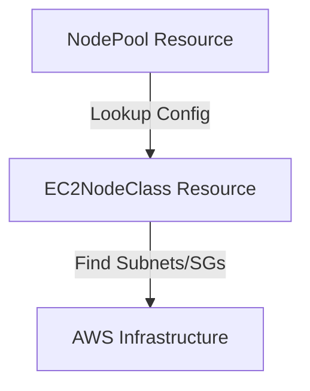

# k8s/karpenter-config/templates Folder Reference

## Purpose
This folder owns the Karpenter configuration templates that specify node scaling specifications. It determines instance constraints, disk structures, and subnet mappings.

## File-by-file explanation

### [ec2nodeclass.yaml](file:///home/selva/Documents/k8s/karpenter_simple_example/k8s/karpenter-config/templates/ec2nodeclass.yaml)
Defines AWS-specific settings for launched EC2 instances.

- > `apiVersion: karpenter.k8s.aws/v1`
  > Target stable Karpenter AWS provider custom resource API group.

- > `kind: EC2NodeClass`
  > Declares this resource is an EC2NodeClass configuration template.

- > `spec.amiFamily: AL2023`
  > Specifies Amazon Linux 2023 family optimization for worker nodes.

- > `spec.amiSelectorTerms`
  > Selects target AMIs.
  - > `alias: al2023@latest`
    > Auto-discovers the latest EKS-optimized AL2023 AMI. Required in Karpenter v1 API.

- > `spec.role: "karpenter-node-role"`
  > Hardcoded IAM Instance Profile role name. Must match `node_iam_role_name` in [iam-karpenter.tf](file:///home/selva/Documents/k8s/karpenter_simple_example/terraform/iam-karpenter.tf#L54). If wrong, EC2 nodes launch but fail to join the cluster.

- > `spec.subnetSelectorTerms`
  > Subnet lookup filter tags.
  - > `karpenter.sh/discovery: {{ .Values.clusterName }}`
    > Finds subnets tagged with `karpenter.sh/discovery = <clusterName>` (configured in [vpc.tf](file:///home/selva/Documents/k8s/karpenter_simple_example/terraform/vpc.tf#L57)). If wrong, Karpenter cannot bind subnets.

- > `spec.securityGroupSelectorTerms`
  > Security groups tags check.
  - > `karpenter.sh/discovery: {{ .Values.clusterName }}`
    > Finds security groups tagged with `karpenter.sh/discovery = <clusterName>` (configured in [eks.tf](file:///home/selva/Documents/k8s/karpenter_simple_example/terraform/eks.tf#L114)).

- > `spec.blockDeviceMappings`
  > Disk setup.
  - > `volumeSize: 50Gi` / `volumeType: gp3` / `encrypted: true`
    > Instantiates a 50Gi GP3 root disk with encryption active to meet compliance requirements.

---

### [nodepool.yaml](file:///home/selva/Documents/k8s/karpenter_simple_example/k8s/karpenter-config/templates/nodepool.yaml)
Defines provider-neutral scheduling boundaries.

- > `apiVersion: karpenter.sh/v1`
  > Stable neutral Karpenter resource API.

- > `spec.template.metadata.labels.role: application`
  > Assigns labels to nodes, allowing application pod affinites to match.

- > `spec.template.spec.nodeClassRef`
  > Binds this NodePool to our EC2NodeClass template.
  - > `group: karpenter.k8s.aws` / `kind: EC2NodeClass` / `name: default`
    > Target reference parameters.

- > `spec.template.spec.requirements`
  > Constraints used to select EC2 capacity.
  - > `key: karpenter.sh/capacity-type`
    > Allows Spot and On-Demand (`["on-demand", "spot"]`). Spot is preferred for costs.
  - > `key: kubernetes.io/arch`
    > Pins nodes to `amd64` architecture.
  - > `key: karpenter.k8s.aws/instance-category`
    > Filters instances to compute, memory, and general purpose families (`["c", "m", "r"]`).
  - > `key: karpenter.k8s.aws/instance-generation`
    > Excludes old instance generations (`operator: Gt`, `values: ["2"]`).
  - > `key: karpenter.k8s.aws/instance-size`
    > Excludes small burstable nodes (`operator: NotIn`, `values: ["nano", "micro", "small", "metal"]`) to optimize scheduling densities.

- > `spec.limits`
  > Resource cap overrides (cpu: `"100"`, memory: `400Gi`) to control max billing rates.

- > `spec.disruption`
  > Node pruning policies.
  - > `consolidationPolicy: WhenEmptyOrUnderutilized`
    > Cleans up empty or low-load nodes. Consolidated from `WhenUnderutilized` in v1 API.
  - > `consolidateAfter: 1m`
    > Wait duration before initiating replacements.

---

## Architecture
The NodePool resource references the EC2NodeClass to look up infrastructure parameters when provisioning instances:



## Versions & APIs used
- **NodePool API**: `karpenter.sh/v1`
- **EC2NodeClass API**: `karpenter.k8s.aws/v1`

## Prerequisites
- Karpenter controller running (sync wave 1).
- Subnets and security groups tagged in AWS console.

## Commands
### 1. Dry-run render configuration
```bash
helm template k8s/karpenter-config
```

## Troubleshooting
### 1. Karpenter logs show `no subnets found matching tags`
- **Cause**: The tags are missing from EKS subnets.
- **Fix**: Check `vpc.tf` private subnet tags and verify tag key-values match `clusterName`.

### 2. NodeClass validation errors
- **Cause**: Missing alias or name keys in AMI selector block.
- **Fix**: Verify `amiSelectorTerms` alias block is specified correctly.

## Official doc links
- [Karpenter NodePools Reference Guide](https://karpenter.sh/docs/concepts/nodepools/)
- [Karpenter NodeClasses Reference Guide](https://karpenter.sh/docs/concepts/nodeclasses/)
