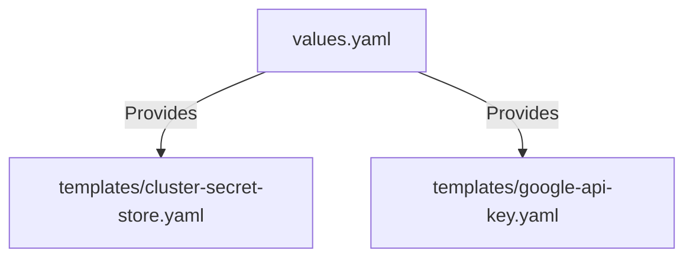

# k8s/secrets Folder Reference

## Purpose
This folder owns the Helm values configurations representing AWS Secrets Manager sync parameters. It overrides default variables mapping targets.

## File-by-file explanation

### [Chart.yaml](file:///home/selva/Documents/k8s/karpenter_simple_example/k8s/secrets/Chart.yaml)
Specifies chart metadata.
- > `apiVersion: v2`
  > Declares compatibility with Helm 3.x specifications.
- > `name: app-secrets`
  > Chart name identifier.
- > `version: 1.0.0`
  > Chart version tag.

---

### [values.yaml](file:///home/selva/Documents/k8s/karpenter_simple_example/k8s/secrets/values.yaml)
Defines variables mapping.

- > `clusterName: ""`
  > target EKS cluster name. Used to locate secrets under specific paths. Matches `cluster_name` in [variables.tf](file:///home/selva/Documents/k8s/karpenter_simple_example/terraform/variables.tf#L24).
- > `awsRegion: ""`
  > Target region where secrets reside. Matches `aws_region` in [variables.tf](file:///home/selva/Documents/k8s/karpenter_simple_example/terraform/variables.tf#L18).

---

## Architecture
The values in `values.yaml` feed the rendering loop of the template engine to populate Secrets Manager endpoints.



## Versions & APIs used
- **Helm API Version**: `v2`

## Prerequisites
- Helm `3.17+` installed.

## Commands
### 1. View rendered templates
```bash
helm template k8s/secrets
```

## Troubleshooting
### 1. Variables render empty
- **Cause**: The parent overrides in `app-of-apps.yaml` were omitted.
- **Fix**: Check `spec.source.helm.parameters` inside the applied `app-of-apps.yaml` file.

## Official doc links
- [Helm Value Files Documentation](https://helm.sh/docs/chart_best_practices/values/)
