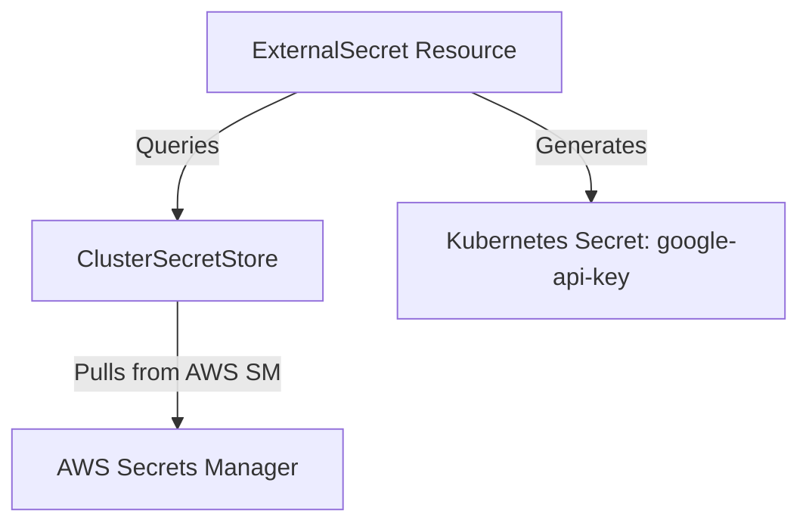

# k8s/secrets/templates Folder Reference

## Purpose
This folder owns the Kubernetes resource templates for secret synchronization. It configures the connection between the External Secrets Operator and AWS Secrets Manager.

## File-by-file explanation

### [cluster-secret-store.yaml](file:///home/selva/Documents/k8s/karpenter_simple_example/k8s/secrets/templates/cluster-secret-store.yaml)
Declares the cluster-wide secret store provider.

- > `apiVersion: external-secrets.io/v1beta1`
  > Target stable API group for External Secrets Operator configurations.

- > `kind: ClusterSecretStore`
  > Declares this resource is a ClusterSecretStore provider. Available across all namespaces in the cluster.

- > `spec.provider.aws.service: SecretsManager`
  > Directs the operator to query AWS Secrets Manager API endpoints. If wrong, calls resolve to Parameter Store instead.

- > `spec.provider.aws.region: {{ .Values.awsRegion }}`
  > AWS Region target. Matches `awsRegion` parameter in [values.yaml](file:///home/selva/Documents/k8s/karpenter_simple_example/k8s/secrets/values.yaml#L3).

---

### [google-api-key.yaml](file:///home/selva/Documents/k8s/karpenter_simple_example/k8s/secrets/templates/google-api-key.yaml)
Binds remote Secrets Manager keys to local Kubernetes Secret resources.

- > `apiVersion: external-secrets.io/v1beta1`
  > Target stable API version group.

- > `kind: ExternalSecret`
  > Declares this resource is an ExternalSecret definition.

- > `metadata.name: google-api-key`
  > Specifies resource name identifier.

- > `metadata.namespace: fastapi`
  > Deploys the configuration in the target FastAPI namespace.

- > `spec.refreshInterval: 1h`
  > Refresh duration. Tells the operator to query AWS Secrets Manager every 1 hour to fetch updated secret values.

- > `spec.secretStoreRef`
  > References the provider config.
  - > `name: aws-secrets-manager` / `kind: ClusterSecretStore`
    > Binds to our ClusterSecretStore definition.

- > `spec.target`
  > Kubernetes Secret output target configuration.
  - > `name: google-api-key`
    > Name of the generated Secret. Mounted as env var inside [deployment.yaml](file:///home/selva/Documents/k8s/karpenter_simple_example/k8s/fastapi/templates/deployment.yaml#L97). If wrong, the deployment pods fail startup check.
  - > `creationPolicy: Owner`
    > Configures lifecycle boundaries. Tells the operator to manage the target secret (deletes it if the ExternalSecret is deleted).

- > `spec.data`
  > Declares key mapping.
  - > `secretKey: GOOGLE_API_KEY`
    > Key name inside the generated Kubernetes Secret. Referenced inside [deployment.yaml](file:///home/selva/Documents/k8s/karpenter_simple_example/k8s/fastapi/templates/deployment.yaml#L98).
  - > `remoteRef.key: {{ printf "%s/GOOGLE_API_KEY" .Values.clusterName | quote }}`
    > AWS Secrets Manager key name (e.g. `karpenter-demo/GOOGLE_API_KEY`). Matches the secret name provisioned in [secrets.tf](file:///home/selva/Documents/k8s/karpenter_simple_example/terraform/secrets.tf#L20). If wrong, synchronization fails.

---

## Architecture
The ExternalSecret references the ClusterSecretStore to connect to AWS and generate a standard Kubernetes Secret.



## Versions & APIs used
- **External Secrets Operator API**: `external-secrets.io/v1beta1`

## Prerequisites
- External Secrets Operator running (sync wave 0).
- IAM role mapping configured (defined in [iam-external-secrets.tf](file:///home/selva/Documents/k8s/karpenter_simple_example/terraform/iam-external-secrets.tf#L28)).

## Commands
### 1. View rendered manifests
```bash
helm template k8s/secrets
```

## Troubleshooting
### 1. ExternalSecret status shows `AccessDenied`
- **Cause**: The IAM role assigned to the External Secrets ServiceAccount is missing policies to read the target secret path.
- **Fix**: Check `Resource` ARN boundaries inside `iam-external-secrets.tf`.

### 2. Secret values remain blank or fail to sync
- **Cause**: The secret name placeholder was not created in AWS Secrets Manager.
- **Fix**: Run `terraform apply` to provision the secret, then manual input the value.

## Official doc links
- [External Secrets Operator Reference Guide](https://external-secrets.io/latest/)
