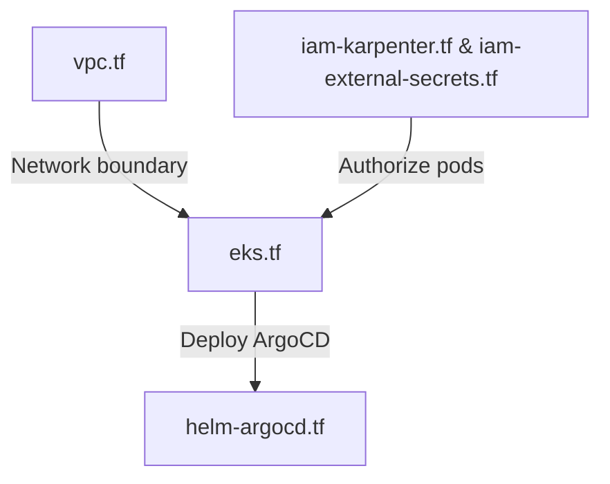

# terraform Folder Reference

## Purpose
This folder owns the AWS infrastructure definitions. It uses Terraform to provision EKS, VPC networking, ECR registries, Secrets Manager secrets, and the IAM access mappings required by operators.

## File-by-file explanation

### [providers.tf](file:///home/selva/Documents/k8s/karpenter_simple_example/terraform/providers.tf)
Declares provider configurations and API authentication parameters.

- > `required_version = ">= 1.8"`
  > Minimum Terraform engine version requirement. If run on older versions, execution blocks.
- > `aws = { source = "hashicorp/aws", version = "~> 6.0" }`
  > Pins AWS Provider to `6.x` to use latest features (like per-resource region configurations).
- > `provider "aws" { region = var.aws_region }`
  > Instantiates the default AWS provider block.
- > `provider "kubernetes" { host = module.eks.cluster_endpoint, ... }`
  > Configures Kubernetes access. Uses short-lived STS tokens dynamically fetched via `aws eks get-token` commands. Avoids static kubeconfig credential dependencies.
- > `provider "helm" { ... }`
  > Configures Helm provider access using the same STS token execution block.

---

### [variables.tf](file:///home/selva/Documents/k8s/karpenter_simple_example/terraform/variables.tf)
Declares input variables.

- > `variable "aws_region"`
  > Target region (default `"ap-south-1"`). Scopes all resources.
- > `variable "cluster_name"`
  > Cluster name identifier (default `"karpenter-demo"`). References Karpenter tags.
- > `variable "cluster_version"`
  > Default Kubernetes version (default `"1.33"`).
- > `variable "git_repository_url"`
  > Repository URL containing manifests. Passed to ArgoCD.

---

### [main.tf](file:///home/selva/Documents/k8s/karpenter_simple_example/terraform/main.tf)
Discovers account data and declares shared locals.

- > `locals.tags`
  > Common tag variables applied across all resources.
- > `data "aws_availability_zones" "available"`
  > Discovers AZs. Filters out opt-in local zones to ensure only standard AZs are returned.
- > `data "aws_caller_identity" "current"`
  > Fetches AWS account properties.

---

### [vpc.tf](file:///home/selva/Documents/k8s/karpenter_simple_example/terraform/vpc.tf)
Configures VPC, NAT Gateway, and subnets routing.

- > `module "vpc" { source = "terraform-aws-modules/vpc/aws", version = "~> 6.6.1" }`
  > provisions the network boundaries.
- > `cidr = "10.0.0.0/16"`
  > Subnet mask range providing up to 65k IPs.
- > `private_subnets` / `public_subnets`
  > Allocates IP CIDRs per Availability Zone.
- > `enable_nat_gateway = true` / `single_nat_gateway = true`
  > Deploys a NAT gateway to allow private subnets outbound web access. Uses a single NAT gateway to minimize monthly AWS billing fees (production should toggle this to `false` for HA).
- > `public_subnet_tags = { "kubernetes.io/role/elb" = 1 }`
  > Tells the AWS Load Balancer Controller to deploy external NLBs here.
- > `private_subnet_tags = { "kubernetes.io/role/internal-elb" = 1, "karpenter.sh/discovery" = local.cluster_name }`
  > Configures subnet lookup keys. Matches `subnetSelectorTerms` in [ec2nodeclass.yaml](file:///home/selva/Documents/k8s/karpenter_simple_example/k8s/karpenter-config/templates/ec2nodeclass.yaml#L49-L52).

---

### [eks.tf](file:///home/selva/Documents/k8s/karpenter_simple_example/terraform/eks.tf)
Bootstraps the EKS cluster.

- > `module "eks" { source = "terraform-aws-modules/eks/aws", version = "~> 21.23.0" }`
  > Provisions EKS control plane.
- > `kubernetes_version = var.cluster_version`
  > Target EKS version.
- > `enable_cluster_creator_admin_permissions = true`
  > Adds the identity running Terraform apply to EKS Access Entries with admin permissions.
- > `addons`
  > Installs critical controllers: `coredns`, `kube-proxy`, `vpc-cni`, `eks-pod-identity-agent`. EKS Pod Identity Agent is required by Karpenter to assume IAM roles without SA annotations.
- > `eks_managed_node_groups.system`
  > Fixed size node group (`desired_size = 2`) running on `m5.large` instances.
  - > `taints`
    > Annotates nodes with `CriticalAddonsOnly=true:NoSchedule` taint. Restricts these nodes to run only system pods (ArgoCD, Karpenter, etc.). Workload pods are scheduled on Karpenter-provisioned nodes.
- > `node_security_group_tags = { "karpenter.sh/discovery" = local.cluster_name }`
  > Configures security group tags (matches `securityGroupSelectorTerms` in [ec2nodeclass.yaml](file:///home/selva/Documents/k8s/karpenter_simple_example/k8s/karpenter-config/templates/ec2nodeclass.yaml#L54-L58)).

---

### [iam-karpenter.tf](file:///home/selva/Documents/k8s/karpenter_simple_example/terraform/iam-karpenter.tf)
Configures Karpenter controller IAM bindings.

- > `module "karpenter" { source = "terraform-aws-modules/eks/aws//modules/karpenter", version = "~> 21.23.0" }`
  > provisions role associations.
- > `create_pod_identity_association = true`
  > Binds EKS Pod Identity mapping to Karpenter.
- > `node_iam_role_name = "karpenter-node-role"`
  > Hardcoded IAM role name assigned to worker nodes provisioned by Karpenter. Matches `role` in [ec2nodeclass.yaml](file:///home/selva/Documents/k8s/karpenter_simple_example/k8s/karpenter-config/templates/ec2nodeclass.yaml#L46).

---

### [iam-external-secrets.tf](file:///home/selva/Documents/k8s/karpenter_simple_example/terraform/iam-external-secrets.tf)
IAM bindings for Secrets Operator.

- > `aws_iam_role.external_secrets`
  > Declares trust policies scoping assumption to the `external-secrets` ServiceAccount.
- > `aws_iam_role_policy.external_secrets_secretsmanager`
  > Grants read rights specifically to path `arn:aws:secretsmanager:*:*:secret:${local.cluster_name}/*` only.
- > `kubernetes_service_account_v1.external_secrets`
  > Creates the ServiceAccount resource annotated with the target role ARN.

---

### [secrets.tf](file:///home/selva/Documents/k8s/karpenter_simple_example/terraform/secrets.tf)
Provisions Secrets Manager placeholders.

- > `aws_secretsmanager_secret.google_api_key`
  > Path `${local.cluster_name}/GOOGLE_API_KEY`. Matches query path in [google-api-key.yaml](file:///home/selva/Documents/k8s/karpenter_simple_example/k8s/secrets/templates/google-api-key.yaml#L30).
- > `recovery_window_in_days = 7`
  > Restricts immediate deletions, allowing recovery if destroyed by accident.

---

### [ecr.tf](file:///home/selva/Documents/k8s/karpenter_simple_example/terraform/ecr.tf)
ECR repository configuration.

- > `aws_ecr_repository.fastapi`
  > Creates registry name `"fastapi-app"` (matches ECR target in [app-ci.yaml](file:///home/selva/Documents/k8s/karpenter_simple_example/.github/workflows/app-ci.yaml#L13)).
  - > `scan_on_push = true`
    > Triggers image security scanning on push.
  - > `force_delete = true`
    > Allows destroying the repository during `terraform destroy` even if it contains image layers.
- > `aws_ecr_lifecycle_policy.fastapi`
  > Enforces keeping only the 20 most recent image tags to control storage billing.

---

### [helm-argocd.tf](file:///home/selva/Documents/k8s/karpenter_simple_example/terraform/helm-argocd.tf)
Bootstraps ArgoCD.

- > `helm_release.argocd`
  > Installs the chart.
  - > `configs.repositories.karpenter-oci.url`
    > Registers Karpenter public OCI registry `oci://public.ecr.aws/karpenter` to authorize image pulls.

---

### [helm-karpenter.tf](file:///home/selva/Documents/k8s/karpenter_simple_example/terraform/helm-karpenter.tf)
Architectural reference guide explaining GitOps layout (no resource definitions).

---

### [outputs.tf](file:///home/selva/Documents/k8s/karpenter_simple_example/terraform/outputs.tf)
Exposes endpoint and configuration command strings.

---

## Architecture
The infrastructure layers are created sequentially:



## Versions & APIs used
- **Terraform Engine**: `>= 1.8`
- **AWS Provider**: `~> 6.0`
- **Kubernetes Provider**: `~> 3.1.0`
- **Helm Provider**: `~> 3.2.0`

## Prerequisites
- AWS admin credentials configured.

## Commands
### 1. Provision AWS resources
```bash
terraform init
terraform plan
terraform apply
```

## Troubleshooting
### 1. `terraform apply` fails with `ResourceInUse`
- **Cause**: EKS cluster name or ECR registry name matches an existing resource.
- **Fix**: Override `cluster_name` in `variables.tf` or provide a variables override file.

### 2. Provider authentication fails during execution
- **Cause**: Your local STS session has expired.
- **Fix**: Re-authenticate using your local terminal authentication configuration tools.

## Official doc links
- [Terraform AWS Provider Reference](https://registry.terraform.io/providers/hashicorp/aws/latest/docs)
