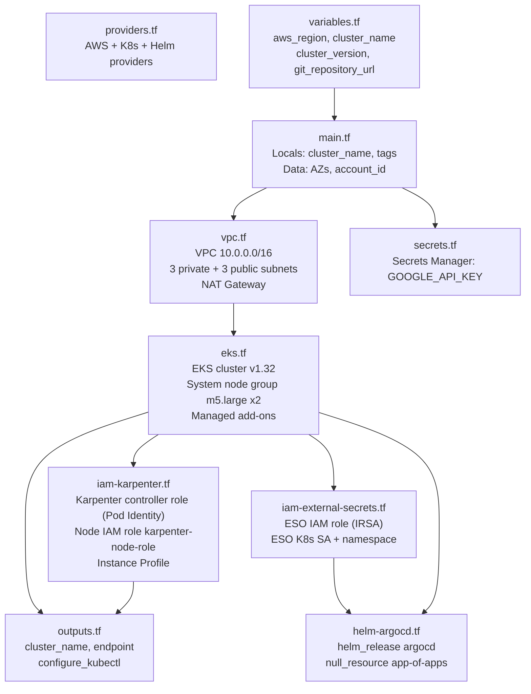

# terraform/ — AWS Infrastructure

Terraform provisions the AWS foundation (VPC, EKS, IAM, Secrets Manager, ArgoCD). It runs **once**. After ArgoCD is bootstrapped, all further changes are made through Git.

---

## What Terraform Owns vs ArgoCD

```
Terraform (runs once)               ArgoCD (runs continuously)
─────────────────────────────       ──────────────────────────────────
VPC + subnets + NAT Gateway         cert-manager
EKS cluster + system node group     external-secrets (Helm chart)
IAM roles (Karpenter, ESO)          Karpenter (Helm chart)
Secrets Manager secrets             NodePool + EC2NodeClass
ArgoCD (Helm install)               ingress-nginx, prometheus
App-of-Apps Application             FastAPI application
```

---

## Dependency Graph



---

## File Reference

### `providers.tf` — Provider Configuration

```hcl
terraform {
  required_version = ">= 1.8"     # Minimum Terraform CLI version
  required_providers {
    aws        = "~> 6.0"          # AWS Provider v6+ required by eks module v21+
    kubernetes = "~> 3.1.0"        # Manages K8s-native resources (ServiceAccount, Namespace)
    helm       = "~> 3.2.0"        # Manages Helm chart installs (ArgoCD only)
  }
}

provider "aws" {
  region = var.aws_region          # All AWS resources go here (us-east-1 default)
}

provider "kubernetes" {
  host = module.eks.cluster_endpoint            # K8s API server URL
  cluster_ca_certificate = base64decode(...)    # Verify TLS with cluster CA
  exec {
    command = "aws"
    args = ["eks", "get-token", "--cluster-name", ...]
    # Fetches a short-lived STS token on every kubectl call
    # No static kubeconfig stored on disk
  }
}
```

**Why exec-based auth?** Static kubeconfig files contain long-lived credentials. The `aws eks get-token` approach generates ephemeral tokens using the caller's current IAM identity — safer for CI/CD.

---

### `main.tf` — Shared Locals and Data Sources

```hcl
locals {
  cluster_name = var.cluster_name   # Single source of truth — referenced by VPC, EKS, IAM, Helm
  tags = {
    Environment = var.environment   # Applied to every AWS resource (cost filtering)
    ManagedBy   = "Terraform"
    Project     = "karpenter-demo"
    Cluster     = var.cluster_name
  }
}

data "aws_availability_zones" "available" {
  filter {
    name   = "opt-in-status"
    values = ["opt-in-not-required"]  # Excludes Local Zones (wavelength, outpost)
  }
}

data "aws_caller_identity" "current" {}  # Used to get AWS account ID for ARN construction
```

---

### `variables.tf` — Input Variables

| Variable | Default | Description |
|---|---|---|
| `aws_region` | `us-east-1` | AWS region for all resources |
| `cluster_name` | `karpenter-demo` | EKS cluster name; also used in Karpenter discovery tags and secret paths |
| `cluster_version` | `1.32` | Kubernetes version |
| `environment` | `production` | Tag applied to all AWS resources |
| `git_repository_url` | `YOUR_ORG placeholder` | ArgoCD watches this Git repo |

Override at apply time:
```bash
terraform apply -var='cluster_name=my-cluster' -var='git_repository_url=https://github.com/...'
```

---

### `vpc.tf` — Virtual Private Cloud

```hcl
module "vpc" {
  cidr = "10.0.0.0/16"             # ~65,000 IP addresses

  azs             = slice(data.aws_availability_zones.available.names, 0, 3)
  # Picks the first 3 AZs in the region (e.g. us-east-1a, 1b, 1c)

  private_subnets = ["10.0.1.0/24", "10.0.2.0/24", "10.0.3.0/24"]
  # EKS nodes and pods run here. Not directly reachable from the internet.

  public_subnets  = ["10.0.101.0/24", "10.0.102.0/24", "10.0.103.0/24"]
  # Load balancers (NLB/ALB) face the internet from here.

  enable_nat_gateway = true
  single_nat_gateway = true
  # single=true: one NAT for all private subnets (cost-saving for non-prod)
  # single=false: one NAT per AZ (high availability, recommended for prod)

  enable_dns_hostnames = true  # Required: pods need DNS resolution
  enable_dns_support   = true  # Required: VPC-internal DNS must work
}
```

**Subnet tags explained:**

| Tag | Subnet | Purpose |
|---|---|---|
| `kubernetes.io/role/elb = 1` | Public | AWS LB Controller places internet-facing ALBs/NLBs here |
| `kubernetes.io/role/internal-elb = 1` | Private | AWS LB Controller places internal LBs here |
| `karpenter.sh/discovery = karpenter-demo` | Private | Karpenter selects these subnets when launching EC2 nodes |

---

### `eks.tf` — EKS Cluster

```hcl
module "eks" {
  name               = local.cluster_name   # "karpenter-demo"
  kubernetes_version = var.cluster_version  # "1.32"

  endpoint_public_access  = true   # API server reachable from internet
  endpoint_private_access = true   # Also reachable within VPC

  vpc_id     = module.vpc.vpc_id
  subnet_ids = module.vpc.private_subnets   # Control plane ENIs placed in private subnets

  enable_cluster_creator_admin_permissions = true
  # Grants the IAM identity running terraform apply cluster-admin access
  # via EKS Access Entries (no aws-auth ConfigMap needed)
}
```

**Managed Add-ons:**

| Add-on | What it does | Why |
|---|---|---|
| `coredns` | Cluster-internal DNS resolution | `my-service.my-namespace.svc.cluster.local` → pod IP |
| `kube-proxy` | Programs iptables/ipvs for Service routing | Routes ClusterIP traffic to pod endpoints |
| `vpc-cni` | Assigns real VPC IPs to pods | Each pod gets its own ENI IP — no overlay network overhead |
| `eks-pod-identity-agent` | Intercepts AWS credential requests from pods | Required for Karpenter Pod Identity to work |

**System Node Group:**
```hcl
eks_managed_node_groups = {
  system = {
    instance_types = ["m5.large"]   # 2 vCPU, 8 GiB — enough for ArgoCD + Karpenter
    min_size       = 2              # Always keep 2 for HA
    max_size       = 3
    desired_size   = 2

    taints = {
      system_only = {
        key    = "CriticalAddonsOnly"
        value  = "true"
        effect = "NO_SCHEDULE"       # Prevents app pods from landing here
      }
    }
  }
}

node_security_group_tags = {
  "karpenter.sh/discovery" = local.cluster_name
  # Karpenter finds which SGs to attach to nodes it launches by this tag
}
```

---

### `iam-karpenter.tf` — Karpenter IAM

```hcl
module "karpenter" {
  create_pod_identity_association = true
  # Pod Identity: AWS injects credentials into the Karpenter pod automatically
  # based on the (namespace=kube-system, serviceaccount=karpenter) mapping.
  # No annotation needed on the ServiceAccount.

  create_node_iam_role = true
  node_iam_role_additional_policies = {
    AmazonSSMManagedInstanceCore = "arn:aws:iam::aws:policy/..."
    # Enables SSM Session Manager — connect to nodes without SSH keys
  }

  node_iam_role_use_name_prefix = false
  node_iam_role_name            = "karpenter-node-role"
  # Hardcoded name — referenced directly in k8s/karpenter-config/ec2nodeclass.yaml
  # EC2NodeClass.spec.role = "karpenter-node-role" (AWS IAM role NAME, not ARN)
}
```

**Two different roles — common confusion:**

| Role | Layer | Used by | Purpose |
|---|---|---|---|
| Karpenter controller role | AWS IAM | Karpenter pod | Allows Karpenter to call EC2/SQS APIs to launch nodes |
| Node IAM role (`karpenter-node-role`) | AWS IAM | EC2 instances Karpenter launches | Allows nodes to join EKS, pull from ECR, use SSM |

---

### `iam-external-secrets.tf` — ESO IAM

```hcl
resource "aws_iam_role" "external_secrets" {
  assume_role_policy = jsonencode({
    Statement = [{
      Action = "sts:AssumeRoleWithWebIdentity"
      Principal.Federated = module.eks.oidc_provider_arn
      # IRSA: trust the EKS OIDC provider
      Condition.StringEquals = {
        "...oidc.../sub" = "system:serviceaccount:external-secrets:external-secrets"
        # Only THIS specific ServiceAccount can assume this role
      }
    }]
  })
}

resource "aws_iam_role_policy" "external_secrets_secretsmanager" {
  policy = {
    Action   = ["secretsmanager:GetSecretValue", "secretsmanager:DescribeSecret"]
    Resource = "arn:aws:secretsmanager:us-east-1:*:secret:karpenter-demo/*"
    # Scoped to secrets under the cluster prefix only (least privilege)
  }
}

resource "kubernetes_service_account_v1" "external_secrets" {
  metadata.annotations = {
    "eks.amazonaws.com/role-arn" = aws_iam_role.external_secrets.arn
    # This annotation is how IRSA works:
    # When a pod uses this SA, the EKS OIDC webhook injects AWS credentials
    # for the associated IAM role
  }
}
```

---

### `secrets.tf` — AWS Secrets Manager

```hcl
resource "aws_secretsmanager_secret" "google_api_key" {
  name        = "karpenter-demo/GOOGLE_API_KEY"
  # Path convention: <cluster_name>/<SECRET_NAME>
  # Matches the IAM policy Resource ARN scope in iam-external-secrets.tf

  recovery_window_in_days = 7
  # AWS requires 7-day minimum before a secret can be permanently deleted.
  # Prevents accidental destruction of a secret your app depends on.
}
```

**Terraform only creates the secret resource (name, tags, policy). The value is set separately:**
```bash
aws secretsmanager put-secret-value \
  --secret-id karpenter-demo/GOOGLE_API_KEY \
  --secret-string "your-api-key"
```

---

### `helm-argocd.tf` — ArgoCD Bootstrap

```hcl
resource "helm_release" "argocd" {
  repository = "https://argoproj.github.io/argo-helm"
  chart      = "argo-cd"
  version    = "9.5.20"     # Pin the version — ArgoCD manages its own upgrades via GitOps after this
  namespace  = "argocd"

  set = [
    { name = "server.service.type", value = "ClusterIP" },
    # No LoadBalancer — access via port-forward or Ingress only

    { name = "configs.repositories.karpenter-oci.url",       value = "oci://public.ecr.aws/karpenter" },
    { name = "configs.repositories.karpenter-oci.enableOCI", value = "true" },
    # Pre-register the Karpenter OCI registry.
    # Karpenter's Helm chart is an OCI artifact (not a traditional HTTP repo).
    # ArgoCD must know about it before it can pull the chart.
  ]
}

resource "null_resource" "argocd_app_of_apps" {
  triggers = {
    argocd_version = helm_release.argocd.version   # Re-run if ArgoCD is upgraded
    git_repo       = var.git_repository_url         # Re-run if repo URL changes
    eso_sa_version = kubernetes_service_account_v1.external_secrets.metadata[0].resource_version
    # Re-run if the ESO ServiceAccount (IRSA annotation) changes
  }

  provisioner "local-exec" {
    command = <<-EOT
      aws eks update-kubeconfig --name ... --region ...
      # Configure kubectl locally

      export GIT_REPOSITORY_URL="..."
      envsubst < app-of-apps.yaml | kubectl apply -f -
      # envsubst replaces ${GIT_REPOSITORY_URL} in the YAML before applying
    EOT
  }

  depends_on = [helm_release.argocd, kubernetes_service_account_v1.external_secrets]
  # ESO SA must exist BEFORE ArgoCD wave-0 runs, so ESO can auth immediately
}
```

---

### `outputs.tf` — Outputs After Apply

```hcl
output "configure_kubectl" {
  value = "aws eks update-kubeconfig --name karpenter-demo --region us-east-1"
  # Run this command to configure your local kubectl
}

output "karpenter_node_iam_role_name" {
  value = module.karpenter.node_iam_role_name
  # Should be "karpenter-node-role" — must match ec2nodeclass.yaml spec.role
}
```

---

## First-Time Apply Order

Terraform handles dependency resolution automatically. The logical order is:

```
providers.tf + main.tf → VPC → EKS → IAM roles → K8s SA → ArgoCD → App of Apps
```

After `terraform apply` completes, ArgoCD takes over and manages everything else.

---

## Remote State (Production)

Uncomment in `providers.tf`:
```hcl
backend "s3" {
  bucket         = "my-terraform-state-bucket"
  key            = "karpenter-demo/terraform.tfstate"
  region         = "us-east-1"
  dynamodb_table = "terraform-state-lock"   # Prevents concurrent modifications
  encrypt        = true
}
```
